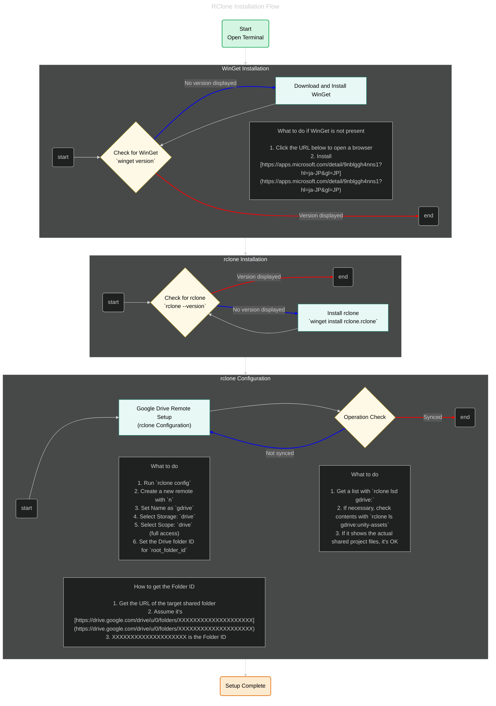

Hello! I'm Pan-kun.

I'm going to manage large files using **rclone** linked with Google Drive on Windows.

I've visualized the following steps in a single flowchart:

* WinGet Introduction (Installation)
* rclone Installation
* Google Drive Remote Configuration
* Operation Check (Verification)

## RClone Installation Flow (Mermaid Version)

The final version of the flowchart is [here](https://breadmotion.github.io/WebSite/content/other/Rclone.html).

---

## What Can This Flow Do?

This flow visualizes the series of steps for executing the following tasks error-free in a Windows environment:

* Dealing with the absence of **WinGet**
* **rclone** installation
* Google Drive remote configuration
* How to obtain the Drive Folder ID
* Procedure for operation verification

This can resolve **bottlenecks in setting up a Git LFS alternative environment on Windows** for yourself or your team.

---

## Overview

This is a method for managing and sharing files in a Windows environment when they exceed the limitations of Git LFS. The general flow is as follows:

* WinGet Installation
* RClone Installation
* RClone Configuration

The subsequent part is about usage and operations, and since it requires further refinement for people unfamiliar with CLI, it's planned for a separate article.

---

## Summary

What was done in this article:
* Visualized the necessary steps for RClone installation
* Created a flowchart using **Mermaid**
* Notes on Drive linkage (e.g., `root_folder_id`)
* Prepared content usable as a manual for the team
