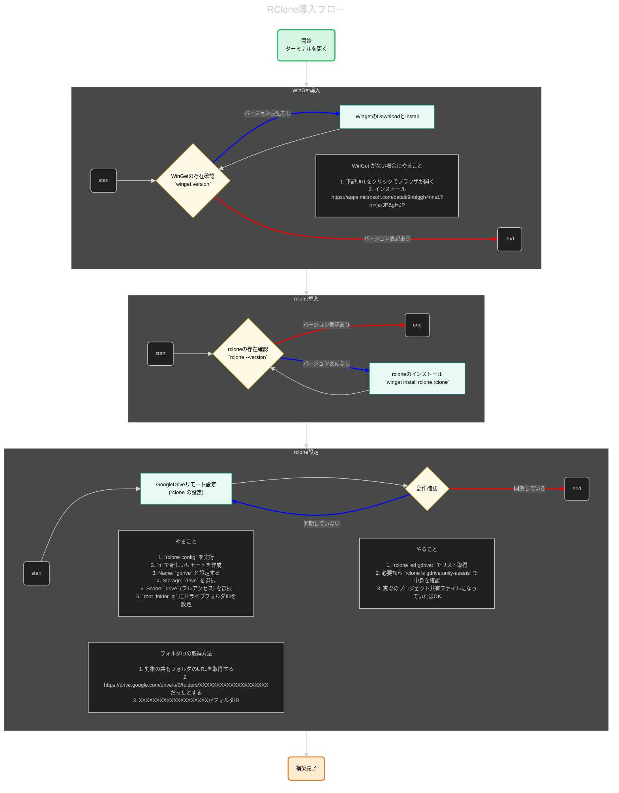

こんにちは！パン君です

WindowsでGoogle Driveと連携し、大容量ファイルをrcloneで管理します。

- WinGet の導入
- rclone のインストール
- Google Drive リモートの設定
- 動作確認
のステップを 一つのフローチャートにまとめて可視化しました。

## RClone 導入フロー（Mermaid版）

最終版のフローチャートは[こちら](https://breadmotion.github.io/WebSite/content/other/Rclone.html)です。

---

## このフローで何ができる？

このフローは、Windows環境で以下の一連の作業をミスなく実行できるように可視化したものです。

- WinGet がない場合の対処
- rclone のインストール
- Google Drive リモート設定
- Drive フォルダ ID の取得方法
- 動作確認の手順

自分やチームの「Windows環境でのGit LFS代用環境構築の詰まりポイント」を解消できます。

---

## 概要

Windows環境でGitLFSの制限外で管理できるように共有したい場合のやり方です。  
大まかな流れは下記です。

- WinGet導入
- RClone導入
- RCloneの設定

これ以降は運用の仕方の話になってくるうえ、  
CLIに慣れていない人に向ける場合、もう一工夫する必要がある為別の記事で記載予定です。

---

## まとめ

この記事で行ったこと：
- RClone 導入に必要なステップを可視化
- Mermaid でフローチャート化
- Drive 連携の注意点（root_folder_id など）
- チーム用の手順書として使える内容に整備
