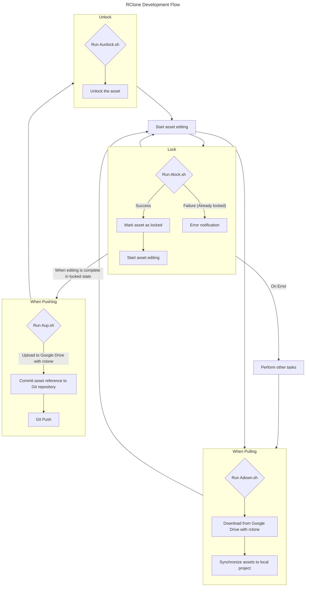

Hello! I'm Pan-kun.

In the previous article, I explained the rclone installation flow and Google Drive integration in a Windows environment.
This time, as a continuation, I will introduce an operational approach that combines **rclone and shell scripting** to address the specific challenge of **managing large-scale assets in a project**.

We will explore a practical approach to solve common problems faced in Git LFS operation, such as capacity limitations and performance issues, and to **streamline asset management and CI/CD integration** in team development.

## Goal of This Article

* Efficiently manage large project assets (models, textures, sounds, etc.) using rclone.
* Automate Git and rclone integration using the following custom shell scripts:
    * `Aup.sh`: Asset upload
    * `Adown.sh`: Asset download
    * `Alock.sh`: Asset lock
    * `Aunlock.sh`: Asset unlock
* Grasp the concept of automated asset synchronization and build integration within a CI/CD pipeline.

## Challenges of Large Asset Management and rclone's Advantages

In game development, large assets in the GB range—such as 3D models, high-resolution textures, and long sound files—appear frequently.
Managing these directly with Git often leads to repository bloat, slow clone and fetch times, and hitting Git LFS capacity limits.

By linking rclone with external storage (like Google Drive), these large-capacity assets can be **separated from the Git repository** and managed efficiently.
Git manages only references to the assets, while the actual data is stored on external storage via rclone, thus achieving repository **lightweightness and speed**.

## UE에서의 RClone Operation Strategy

We will prepare a `Tool` directory in the root directory of the UE project and create four shell scripts (these can be replaced with batch files and adjusted commands if needed):

* `Aup.sh`
* `Adown.sh`
* `Alock.sh`
* `Aunlock.sh`

These scripts will wrap rclone commands, targeting prefixes of potentially large files under the `Assets` directory, to automate asset synchronization and locking.
(If you need to target files other than `.uasset` extension, you should add logic for that.)

### 1. `Aup.sh`: Asset Upload

`Aup.sh` is used to **upload local project assets to Google Drive** (or the configured remote storage).
This is typically executed when asset editing is complete and ready for sharing.

**Usage Example:**
```sh
# Run in the root directory of the Unity project
sh ./Tool/Aup.sh
```

**Internal Process Overview:**
1.  Scan files under the `Content` directory.
2.  Upload each file to the remote storage using the rclone command.
3.  Commit a **placeholder file** (or only path information) for the uploaded asset to the Git repository.

### 2. `Adown.sh`: Asset Download

`Adown.sh` is used to **download assets from remote storage** to the local project.
It is executed when a team member clones the project or wants to update to the latest assets.

**Usage Example:**
```sh
# Run in the root directory of the project
sh ./Tool/Adown.sh
```

**Internal Process Overview:**
1.  Retrieve asset reference information from the Git repository.
2.  Download the corresponding asset files from remote storage to the `Content` directory using the rclone command.
3.  Adjust downloaded assets to be recognized by the editor (if necessary).

### 3. `Alock.sh`: Asset Lock

A locking mechanism is crucial to **prevent conflicts from simultaneous editing** of large assets.
`Alock.sh` locks a specific asset, preventing other members from editing it concurrently.

**Usage Example:**
```sh
# Run in the root directory of the UE project
sh ./Tool/Alock.sh Content/Model/SK_ModelX.uasset
```

**Internal Process Overview:**
1.  Register the lock information for the specified asset in remote storage or a dedicated lock management system.
2.  Reflect the lock status in the Git repository.
3.  Notify of successful lock. Display an error message if already locked.

### 4. `Aunlock.sh`: Asset Unlock

Once asset editing is complete and uploaded using `Aup.sh`, use `Aunlock.sh` to release the lock.

**Usage Example:**
```sh
# Run in the root directory of the project
sh ./Tool/Aunlock.sh Content/Model/SK_ModelX.uasset
```

**Internal Process Overview:**
1.  Release the lock information for the specified asset from remote storage or the lock management system.
2.  Update the lock status in the Git repository.
3.  Notify of successful unlock. Display an error message if the file is not locked or if locked by another user.

## CI/CD Pipeline Integration

These scripts can be easily incorporated into the CI/CD pipeline.

**Example of Automatic Synchronization on the Build Server:**
1.  When CI is triggered, first fetch the repository with `git clone`.
2.  Next, run `./Tool/Adown.sh` to automatically download the necessary assets.
3.  Execute the command line build.

This ensures the build server always executes the build with the latest code and assets, eliminating the need for manual asset synchronization.

## Image Referring to `MMD_rclone.png` (Conceptual Diagram)

The previous RClone installation flowchart (`MMD_rclone.png`) was for RClone setup itself. The asset flow in this operational approach is visualized below. 

The final version of the flowchart is [here](https://breadmotion.github.io/WebSite/content/other/Rclone2.html).



## Importance of Lock/Unlock (`Alock.sh` / `Aunlock.sh`)

When multiple people edit concurrently, avoiding unintended overwrites and conflicts is crucial.
Similar to Git LFS's file locking feature, this locking mechanism is extremely important for rclone-based asset management. `Alock.sh` and `Aunlock.sh` are the custom shell scripts for this purpose.

### `Alock.sh`: Asset Lock

`Alock.sh` marks the specified asset file as "locked" on the remote storage.
This prevents other developers from concurrently editing the same file, significantly reducing the risk of conflicts.

**Main Features:**

* Accepts the path of the specified asset.
* Uses rclone's locking feature (or an external lock management system) to lock the file on remote storage.
* Notifies if the lock is successful.
* Displays information and denies the lock if already locked by another user.

**Operational Concept:**
A developer runs `Alock.sh Content/Model/SK_ModelA.uasset` before starting editing a specific asset. If the lock is successful, they can proceed with the work confidently.

### `Aunlock.sh`: Asset Unlock

Once asset editing is complete and uploaded to remote storage with `Aup.sh`, use `Aunlock.sh` to release the lock.
This allows other developers to lock and edit the latest version of the asset.

**Main Features:**

* Accepts the path of the specified asset.
* Releases the lock on the file in remote storage.
* Notifies if the unlock is successful.
* Notifies of an error if attempting to unlock a file that is not locked or locked by another user.

**Operational Concept:**
After editing and uploading the asset, run `Aunlock.sh Content/Model/SK_ModelA.uasset` to release the lock.
This allows other team members to get the latest version of the asset and lock it to begin editing if necessary.

### Benefits of the Locking Mechanism

* **Conflict Prevention**: Avoids complex merge operations for large-capacity assets.
* **Clear Ownership**: Clearly shows who is editing which asset, preventing unnecessary duplicate work.
* **Team Development Efficiency**: Smoother asset coordination enhances overall development productivity.

These scripts and flow will make project asset management, combining Git and rclone, more robust and efficient when properly operated.

## Summary

Asset management in a project is a critical challenge that significantly impacts team development efficiency.
By combining rclone with custom shell scripts—`Aup.sh`, `Adown.sh`, `Alock.sh`, and `Aunlock.sh`—it becomes possible to keep the Git repository lightweight while efficiently managing large-capacity assets in external storage, and smoothly integrating with the CI/CD pipeline.

Implementing this operational approach allows developers to focus on content creation
