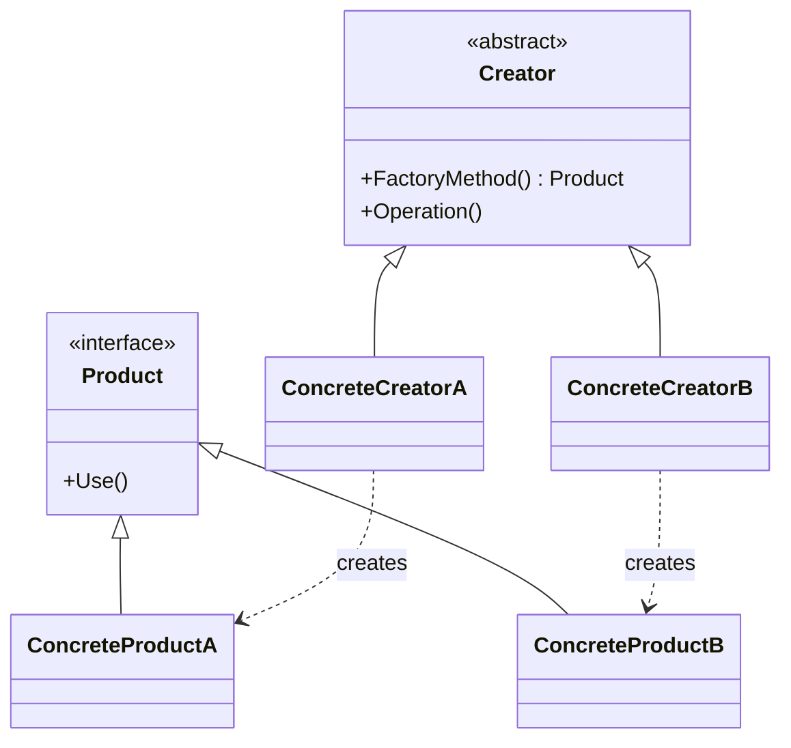

Hi! I'm Pan-kun.

This article covers the Factory Method pattern from the GoF (Gang of Four) design patterns.  
It provides practical guidance including sample code (C++), how to structure it, when to use it, and caveats.

## Introduction

The Factory Method pattern provides a way for subclasses to decide which concrete class to instantiate.  
In other words, it delegates the responsibility for object creation to subclasses so that client code can work with abstractions rather than concrete implementations.

Wikipedia defines it as:

> "In object-oriented programming, the factory method pattern is a creational pattern that uses factory methods to deal with the problem of creating objects without specifying the exact class of object that will be created."  
> (Source: https://en.wikipedia.org/wiki/Factory_method_pattern)

This captures the essence: the "when" and "which class" of creation can be deferred to runtime context or subclass implementations.

## Structure (Elements)

A typical structure consists of:

- `Product` (abstract product): the common interface clients work with.
- `ConcreteProduct`: concrete implementations of the product.
- `Creator` (abstract creator): declares `FactoryMethod()` (and may provide some common behavior).
- `ConcreteCreator`: overrides `FactoryMethod()` to create and return specific `ConcreteProduct` instances.

The `Creator` can perform operations using the created `Product`, and clients interact only with `Creator`'s operations.



> Note: The mermaid block above will render as a class diagram if your Markdown renderer or static site generator has mermaid enabled. If not, convert it to an image or supply an alternate diagram.

## Pros / Cons

Pros:
- Separates creation logic from usage logic.
- Adding a new `ConcreteProduct` typically doesn't require changes to existing client code (open for extension).
- Easier to control which concrete type is produced in tests by substituting the `Creator` (e.g., using test-specific `ConcreteCreator`).

Cons:
- The number of classes can grow as subclasses increase (management overhead).
- Can be over-abstracted for simple cases (over-engineering).
- Decision logic for object creation can become distributed, making the design harder to trace.

## Differences from Simple Factory and Abstract Factory

- `Simple Factory`: A simple utility (often a single function or class) that returns concrete instances based on conditions; not an official GoF pattern but commonly used.
- `Factory Method`: Delegates the choice of concrete class to subclasses via inheritance and polymorphism.
- `Abstract Factory`: Provides an interface to create families of related products; ensures compatibility among products in the same family.

Guidance:
- Use `Factory Method` when you need to create one product type and want subclasses to control creation.
- Use `Abstract Factory` when you need to switch between families of related products (for example, theme-specific UI widget sets).

## Example: C++

Below is a minimal C++ example. `Creator` declares `FactoryMethod()` and `ConcreteCreator` implements it.

```cpp
// Product.h
class Product {
public:
    virtual ~Product() = default;
    virtual const char* Use() const = 0;
};

// ConcreteProductA.h
#include "Product.h"
class ConcreteProductA : public Product {
public:
    const char* Use() const override { return "ConcreteProductA"; }
};

// ConcreteProductB.h
#include "Product.h"
class ConcreteProductB : public Product {
public:
    const char* Use() const override { return "ConcreteProductB"; }
};

// Creator.h
#include <memory>
class Creator {
public:
    virtual ~Creator() = default;
    // Factory Method: delegate creation to subclasses
    virtual std::unique_ptr<Product> FactoryMethod() const = 0;

    // Creator can offer common behavior that uses the created Product
    std::string Operation() const {
        auto product = FactoryMethod();
        return std::string("Creator uses ") + product->Use();
    }
};

// ConcreteCreatorA.h
#include "Creator.h"
#include "ConcreteProductA.h"
class ConcreteCreatorA : public Creator {
public:
    std::unique_ptr<Product> FactoryMethod() const override {
        return std::make_unique<ConcreteProductA>();
    }
};

// ConcreteCreatorB.h
#include "Creator.h"
#include "ConcreteProductB.h"
class ConcreteCreatorB : public Creator {
public:
    std::unique_ptr<Product> FactoryMethod() const override {
        return std::make_unique<ConcreteProductB>();
    }
};

// main.cpp
#include <iostream>
int main() {
    ConcreteCreatorA a;
    ConcreteCreatorB b;
    std::cout << a.Operation() << "\n"; // Creator uses ConcreteProductA
    std::cout << b.Operation() << "\n"; // Creator uses ConcreteProductB
}
```

The key point is that `Creator::Operation()` operates without knowing the concrete `Product` class. Swapping the `ConcreteCreator` changes behavior.

## Example: Python

In dynamic languages the implementation is more concise. Subclasses override `factory_method`.

```cpp
from abc import ABC, abstractmethod

class Product(ABC):
    @abstractmethod
    def use(self) -> str:
        pass

class ConcreteProductA(Product):
    def use(self) -> str:
        return "ConcreteProductA"

class ConcreteProductB(Product):
    def use(self) -> str:
        return "ConcreteProductB"

class Creator(ABC):
    @abstractmethod
    def factory_method(self) -> Product:
        pass

    def operation(self) -> str:
        product = self.factory_method()
        return f"Creator uses {product.use()}"

class ConcreteCreatorA(Creator):
    def factory_method(self) -> Product:
        return ConcreteProductA()

class ConcreteCreatorB(Creator):
    def factory_method(self) -> Product:
        return ConcreteProductB()

if __name__ == "__main__":
    a = ConcreteCreatorA()
    b = ConcreteCreatorB()
    print(a.operation())  # Creator uses ConcreteProductA
    print(b.operation())  # Creator uses ConcreteProductB
```

Using type hints and dependency injection in Python can make testing straightforward.

## Practical Considerations

Impact scope:
- When you extend `Creator` to produce more `Product` types, verify related tests, documentation, and build implications. Changes to produced types can affect serialization, API contracts, and compatibility.

Avoid ambiguity:
- Clearly document where the creation decision is made. When factory logic is spread across many subclasses, readability and maintenance suffer.

Testability:
- Design `Creator` so it can be substituted in tests (e.g., provide test-specific `ConcreteCreator` or inject a factory) to control produced types and states.

Static factory alternatives:
- In some languages, a static factory function or constructor injection is adequate. Weigh the cost of adding the pattern against its benefits.

Avoid unnecessary abstraction:
- For trivial conditional creation, a simple factory or straightforward conditional logic can be more pragmatic than introducing many classes.

## Conclusion

- The Factory Method delegates creation to subclasses, decoupling clients from concrete classes.
- It is effective when product switching or extendable creation is required, but be mindful of the trade-offs (class proliferation and possible over-engineering).
- Design according to language idioms and always confirm testability, documentation, and impact scope.

References:

[!CARD](https://en.wikipedia.org/wiki/Factory_method_pattern)

That's it—stay tuned for future articles covering Abstract Factory, Builder, and other creational patterns. The sample code here is simplified for learning; evaluate carefully before adopting patterns in production.

— Pan-kun
