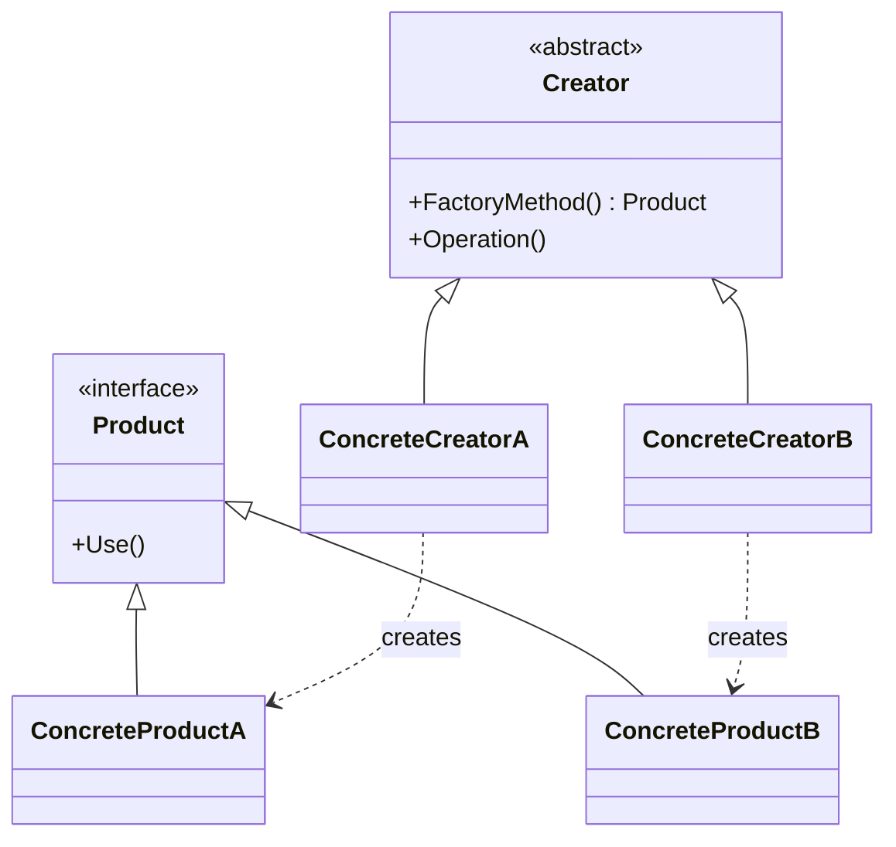

こんにちは！パン君です。

今回は GoF（Gang of Four）のデザインパターンのファクトリメソッド編になります。
サンプルコード（C++）、作り方、使うタイミング、注意点などを含めて実用的に解説します。  

## はじめに

ファクトリメソッドはサブクラスが生成する具体的なクラスを決定するためのメソッドを提供するデザインパターンです。  
言い換えると、オブジェクト生成の責務をサブクラスに委譲することで、クライアントコードは具体的な実装に依存せずに動作できます。

Wikipedia の定義は下記です  

> "オブジェクト指向プログラミングにおいて、ファクトリメソッドパターンは作成されるオブジェクトの正確なクラスを指定せずにオブジェクトを作成する問題に対処するためにファクトリメソッドを使用する生成パターンである。"  
> （出典: [https://en.wikipedia.org/wiki/Factory_method_pattern](https://en.wikipedia.org/wiki/Factory_method_pattern)）

上記はファクトリメソッドの本質を端的に示しています  
生成の「いつ」「どのクラスを」決めるかを実行時の文脈やサブクラスの実装に委ねる、ということです。

## 構造（要素）

典型的な構成は次の通りです。

- `Product`（抽象製品）：クライアントが扱う共通インターフェース
- `ConcreteProduct`：具体的な製品の実装
- `Creator`（抽象作成者）：`FactoryMethod()` を宣言（場合によっては一部の共通処理も持つ）。
- `ConcreteCreator`：`FactoryMethod()` をオーバーライドし、具体的な `ConcreteProduct` を生成して返す。

`Creator` は生成された `Product` を使って何らかの処理を行い、クライアントは `Creator` の操作だけを利用します。



## 短いメリット / デメリット

メリット:
- 生成ロジックと利用ロジックを分離できる。
- 新しい `ConcreteProduct` を追加しても既存のクライアントコードを変更せずに済む（拡張に対して開かれている）。
- テスト時に `Creator` を差し替えることで生成される型を制御できる（モック生成など）。

デメリット:
- サブクラスが増えるとクラス数が増える（サブクラス増加による管理コスト）。
- 単純なケースでは過剰な抽象化になることがある（過剰設計）。
- 生成の決定が分散することで設計を追うのが難しくなる場合がある。

## 「シンプルファクトリ」「抽象ファクトリ」との違い（整理）

- `Simple Factory`: ファクトリ関数/クラスが条件分岐で具体クラスを返す単純な実装。GoF の正式なパターンではないがよく使われる。
- `Factory Method`: サブクラス化により生成クラスを決定する。生成ロジックはオブジェクト指向の多態性で拡張される。
- `Abstract Factory`: 関連する複数のオブジェクト群（製品族）を生成するためのインターフェースを提供する。製品群の整合性を保つ。

選択基準の目安:
- 単一の製品を生成し、サブクラスごとに生成方法を変えたい → `Factory Method`
- 関連する複数の製品群（例：UI ウィジェットのテーマ一式）をまとめて切り替えたい → `Abstract Factory`

## 実装例：C++（典型）

以下は最小限の C++ サンプルです。`Creator` が `FactoryMethod()` を宣言しており、`ConcreteCreator` が具体生成を行います。

```cpp
// Product.h
class Product {
public:
    virtual ~Product() = default;
    virtual const char* Use() const = 0;
};

// ConcreteProductA.h
#include "Product.h"
class ConcreteProductA : public Product {
public:
    const char* Use() const override { return "ConcreteProductA"; }
};

// ConcreteProductB.h
#include "Product.h"
class ConcreteProductB : public Product {
public:
    const char* Use() const override { return "ConcreteProductB"; }
};

// Creator.h
#include <memory>
class Creator {
public:
    virtual ~Creator() = default;
    // Factory Method（生成をサブクラスに委譲）
    virtual std::unique_ptr<Product> FactoryMethod() const = 0;

    // Creator は生成された Product を使う共通処理を持てる
    std::string Operation() const {
        auto product = FactoryMethod();
        return std::string("Creator uses ") + product->Use();
    }
};

// ConcreteCreatorA.h
#include "Creator.h"
#include "ConcreteProductA.h"
class ConcreteCreatorA : public Creator {
public:
    std::unique_ptr<Product> FactoryMethod() const override {
        return std::make_unique<ConcreteProductA>();
    }
};

// ConcreteCreatorB.h
#include "Creator.h"
#include "ConcreteProductB.h"
class ConcreteCreatorB : public Creator {
public:
    std::unique_ptr<Product> FactoryMethod() const override {
        return std::make_unique<ConcreteProductB>();
    }
};

// main.cpp (利用例)
#include <iostream>
int main() {
    ConcreteCreatorA a;
    ConcreteCreatorB b;
    std::cout << a.Operation() << "\n"; // Creator uses ConcreteProductA
    std::cout << b.Operation() << "\n"; // Creator uses ConcreteProductB
}
```

この実装のポイントは、`Creator` の `Operation()` は具体的な `Product` のクラスを知らずに動作する点です。`ConcreteCreator` を差し替えるだけで動作が変わります。

## 実装例：Python（簡潔）

動的言語では実装がさらに簡潔になります。サブクラスで `factory_method` をオーバーライドします。

```python
from abc import ABC, abstractmethod

class Product(ABC):
    @abstractmethod
    def use(self) -> str:
        pass

class ConcreteProductA(Product):
    def use(self) -> str:
        return "ConcreteProductA"

class ConcreteProductB(Product):
    def use(self) -> str:
        return "ConcreteProductB"

class Creator(ABC):
    @abstractmethod
    def factory_method(self) -> Product:
        pass

    def operation(self) -> str:
        product = self.factory_method()
        return f"Creator uses {product.use()}"

class ConcreteCreatorA(Creator):
    def factory_method(self) -> Product:
        return ConcreteProductA()

class ConcreteCreatorB(Creator):
    def factory_method(self) -> Product:
        return ConcreteProductB()

if __name__ == "__main__":
    a = ConcreteCreatorA()
    b = ConcreteCreatorB()
    print(a.operation())  # Creator uses ConcreteProductA
    print(b.operation())  # Creator uses ConcreteProductB
```

Python の場合、型チェックや依存関係注入を組み合わせてテストを容易にできます。

## 実務上の注意点（影響範囲の確認を必ず行う）

- 影響範囲: `Creator` を拡張すると生成される `Product` の種類が増えるため、関連テスト・ドキュメント・ビルド影響を確認してください。特にシリアライズや API 境界で生成される型が変わると互換性影響が出ます。
- 曖昧さの回避: 「生成はどこで決まるか」を明確にし、責務をドキュメント化してください。生成ロジックが分散すると可読性が落ちます。
- テスト性: `Creator` をテスト用に差し替えられるように設計すると良い（テスト専用 `ConcreteCreator` の用意、または依存注入で `factory` を注入）。
- スタティックファクトリとの併用: 言語によっては静的ファクトリ関数やコンストラクタ注入で十分なケースもあります。パターン導入のコストと利得を比較してください。
- 不要な抽象化を避ける: シンプルな条件分岐で十分な場合は `Simple Factory` を選ぶのも現実的です。

## まとめ

- `Factory Method` は生成責務をサブクラスに委譲し、クライアントを具象クラスから分離するパターンです。
- 小さな製品の切り替えや、生成の拡張が見込まれる場合に効果を発揮しますが、クラス数の増加や過剰設計には注意が必要です。
- 実装は言語特性に合わせて設計し、テスト・ドキュメント・影響範囲を必ず確認してください。

出典（一次情報抜粋）:
> "オブジェクト指向プログラミングにおいて、ファクトリメソッドパターンは、作成されるオブジェクトの正確なクラスを指定せずにオブジェクトを作成する問題に対処するためにファクトリメソッドを使用する生成パターンである。" — Wikipedia: Factory method pattern  
> https://en.wikipedia.org/wiki/Factory_method_pattern

[!CARD](https://en.wikipedia.org/wiki/Factory_method_pattern)

それでは、次回は `Abstract Factory` や `Builder` などの生成パターンの実践的な比較記事を予定しています。  
この記事で提示したコードは学習目的に簡潔化しています。実運用に採用する際は要件に合わせて詳細設計・テストを行ってください。

以上、パン君でした！
