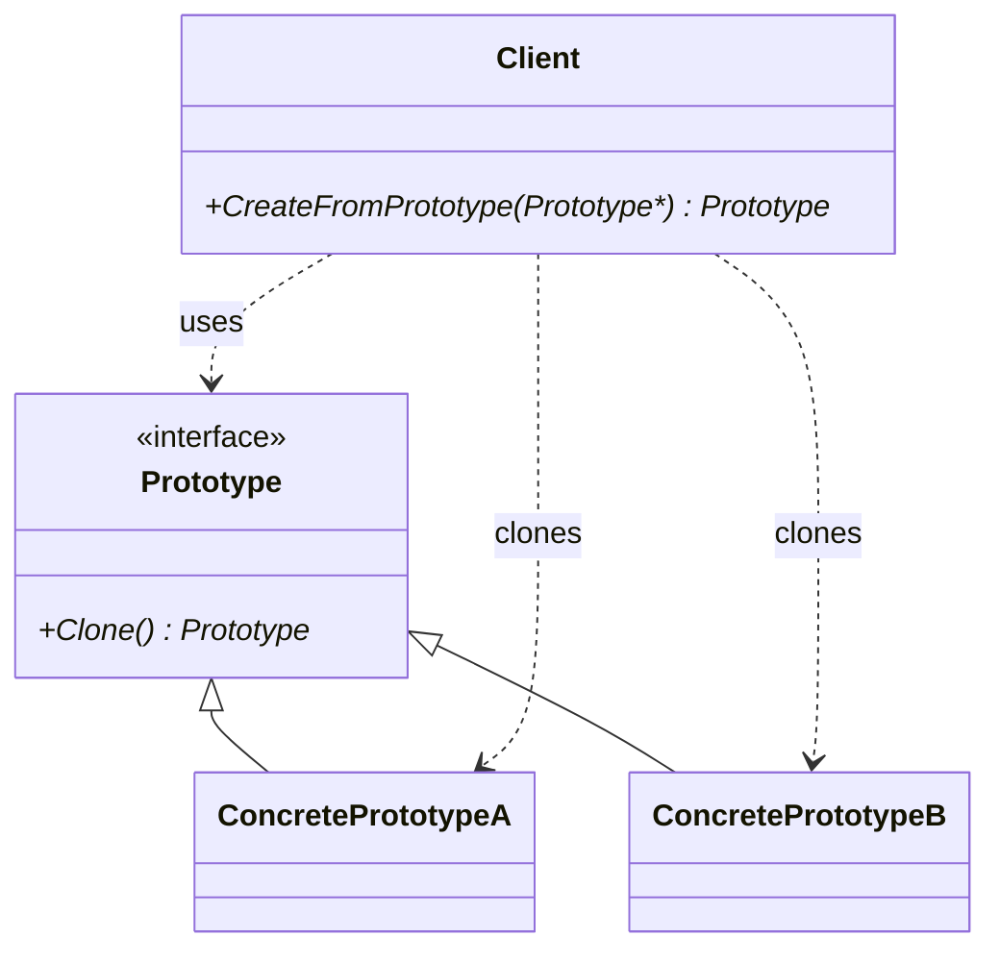

Hello! I'm Pan-kun.

This article covers the Prototype pattern from the GoF (Gang of Four) collection.  
It provides practical guidance: conceptual overview, C++/Python sample code, when to use the pattern, and implementation cautions.

## Introduction

The Prototype pattern is a creational design pattern that creates new objects by copying an existing instance (a prototype). It can be useful when object construction is costly or when it's inconvenient to determine the concrete class at creation time.

Here is the definition from Wikipedia:

> "In software engineering, the prototype pattern is a creational design pattern in which new objects are created by copying a prototypical instance."  
> (Source: https://en.wikipedia.org/wiki/Prototype_pattern)

The core idea is to use cloning to produce new objects. This is especially effective for objects with expensive initialization or when the concrete type is unknown or variable at runtime.

[!CARD](https://en.wikipedia.org/wiki/Prototype_pattern)

## Structure (Participants)

A typical composition includes:

- `Prototype`: Provides the interface for cloning (e.g., `Clone()`).
- `ConcretePrototype`: Concrete classes that implement cloning and adjust copy semantics (deep vs. shallow).
- `Client`: Obtains new instances by calling `Prototype::Clone()` (or `clone()`).
- `PrototypeRegistry` (optional): Manages prototypes by name/key so clients can request clones at runtime.

A simple class diagram (conceptual):



## Pros / Cons

Pros

- Avoids costly initialization by cloning an existing instance.
- Allows creating objects without knowing their concrete classes at runtime (polymorphic cloning).
- Can be dynamically reconfigured by swapping prototypes (runtime flexibility).

Cons

- Implementing correct cloning semantics (deep vs. shallow) can be tricky, especially with shared resources.
- Managing object identity (IDs, handles) after cloning requires clear rules.
- If cloning can be easily achieved via serialization/deserialization or simple copy constructors, the pattern may be unnecessary.

## Example: C++ (recommended approach)

In C++ a common practice is to have `virtual std::unique_ptr<Prototype> Clone() const` so that cloning returns clear ownership. Below is a compact learning example.

```cpp
#include <iostream>
#include <memory>
#include <string>
#include <unordered_map>

// Prototype base
class Prototype {
public:
    virtual ~Prototype() = default;
    // Return a new ownership-bearing clone
    virtual std::unique_ptr<Prototype> Clone() const = 0;
    virtual void Show() const = 0;
};

// Concrete prototype (example with deep-copy semantics)
class ConcretePrototype : public Prototype {
public:
    ConcretePrototype(const std::string& name, int data)
        : name_(name), data_(new int(data)) {}

    // Copy constructor: deep copy
    ConcretePrototype(const ConcretePrototype& other)
        : name_(other.name_), data_(new int(*other.data_)) {}

    // Clone uses the copy constructor to produce a deep copy
    std::unique_ptr<Prototype> Clone() const override {
        return std::make_unique<ConcretePrototype>(*this);
    }

    void Show() const override {
        std::cout << "ConcretePrototype name=" << name_ << " data=" << *data_ << "\n";
    }

    ~ConcretePrototype() { delete data_; }

private:
    std::string name_;
    int* data_; // Simplified: prefer smart pointers in production
};

// Optional: a registry to hold prototype instances
class PrototypeRegistry {
public:
    void Register(const std::string& key, std::unique_ptr<Prototype> prototype) {
        registry_[key] = std::move(prototype);
    }

    std::unique_ptr<Prototype> Create(const std::string& key) const {
        auto it = registry_.find(key);
        if (it != registry_.end()) {
            return it->second->Clone();
        }
        return nullptr;
    }

private:
    std::unordered_map<std::string, std::unique_ptr<Prototype>> registry_;
};

int main() {
    PrototypeRegistry registry;
    registry.Register("protoA", std::make_unique<ConcretePrototype>("A", 100));

    auto p1 = registry.Create("protoA");
    auto p2 = registry.Create("protoA");

    if (p1) p1->Show(); // ConcretePrototype name=A data=100
    if (p2) p2->Show(); // ConcretePrototype name=A data=100

    // p1 and p2 are independent objects if deep copy is implemented correctly
    return 0;
}
```

Key points

- `Clone()` should always return a newly owned object (here via `std::unique_ptr`) so the caller controls lifetime.
- Implement deep copy for members that must not be shared (dynamic arrays, raw pointers, external handles).
- Prefer `std::unique_ptr` / `std::shared_ptr` over raw pointers in production code.

## Example: Python (lightweight)

In Python you can use the `copy` module or implement a `clone()` method. This example demonstrates deep copy.

```python
import copy
from abc import ABC, abstractmethod

class Prototype(ABC):
    @abstractmethod
    def clone(self):
        pass

class ConcretePrototype(Prototype):
    def __init__(self, name, data):
        self.name = name
        self.data = data  # mutable object assumed

    def clone(self):
        # choose between shallow and deep copy as needed
        # return copy.copy(self)    # shallow copy
        return copy.deepcopy(self)  # deep copy

    def show(self):
        print(f"ConcretePrototype name={self.name} data={self.data}")

if __name__ == "__main__":
    proto = ConcretePrototype("pyA", {"k": [1,2,3]})
    c1 = proto.clone()
    c2 = proto.clone()
    c1.show()
    c2.show()
```

You can customize cloning behavior by implementing `__copy__` / `__deepcopy__`.

## Implementation Notes (must-check items)

- Clarify deep vs. shallow copying boundaries. Define which resources should be shared (reference-counted) and which must be duplicated.
- External resources (files, sockets, DB connections) often cannot be trivially copied; provide reinitialization or reconnection logic in clones.
- Object identity: if IDs or handles must be unique, assign new IDs after cloning.
- Thread safety: if prototypes are shared and cloned concurrently, protect registry/state with appropriate synchronization.
- Consider serialization/deserialization as an alternative cloning mechanism when appropriate.

## When to Use / Alternatives

When to use (guidelines)

- When initialization is expensive and you can prepare a prototype once and clone it many times.
- When you need many similar variations derived from a base instance.
- When concrete types are dynamic at runtime and you want to avoid enumerating types in factories.

Alternatives

- If a simple copy constructor suffices, you may not need the full pattern.
- Use `Factory Method` / `Abstract Factory` when you want centralized, controlled object creation rather than cloning.
- Serialization / deserialization can sometimes be used to create independent copies.

## Impact Assessment (required)

Before adopting Prototype, confirm:

- How copies handle state that crosses API boundaries—ensure compatibility for serialization and external contracts.
- Whether cloned objects need new identity semantics (IDs, handles).
- Thread-safety of prototype registration and clone operations.

Document these decisions in design docs, tests, and API contracts.

## Conclusion

- The Prototype pattern uses cloning to produce new objects and can reduce initialization cost and increase runtime flexibility.
- Pay careful attention to copy semantics, external resources, identity, and concurrency.
- In C++, returning `std::unique_ptr` from `Clone()` is a practical design; in dynamic languages like Python, the `copy` module or custom `clone()` implementations are convenient.

References (primary)

[!CARD](https://en.wikipedia.org/wiki/Prototype_pattern)  
"In software engineering, the prototype pattern is a creational design pattern in which new objects are created by copying a prototypical instance."  
(Source: https://en.wikipedia.org/wiki/Prototype_pattern)

(Secondary) For C++ copy/move semantics and smart pointers, consult the official reference:  
[!CARD](https://en.cppreference.com/)

That's it — I'll cover another GoF pattern next time. The sample code here is simplified for learning; evaluate and adapt thoroughly before using in production.

Thanks for reading — Pan-kun!
