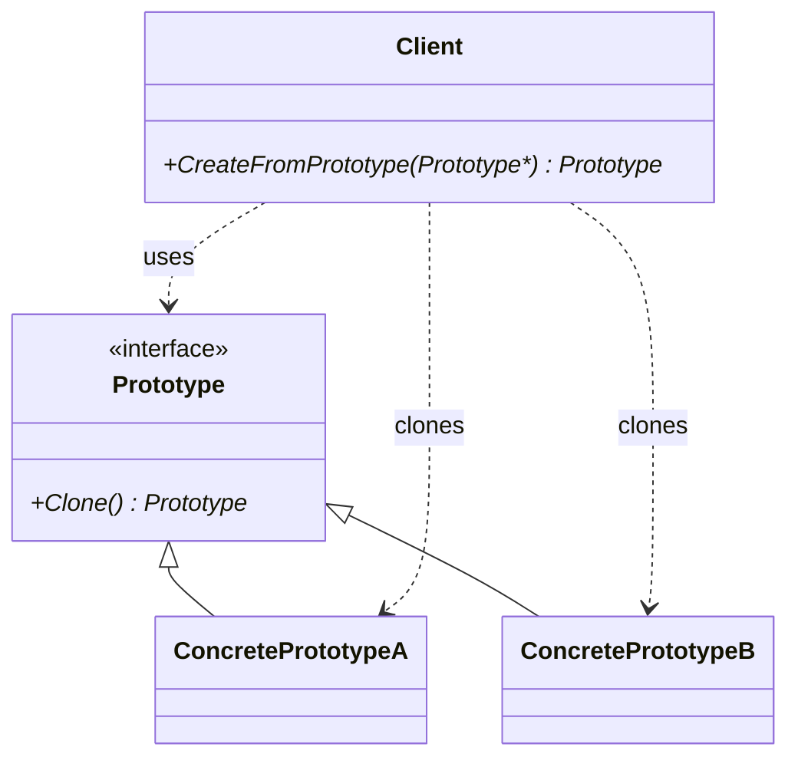

こんにちは！パン君です。

今回は GoF（Gang of Four）のデザインパターンのプロトタイプ編になります。  
サンプルコード（C++/Python）、作り方、使うタイミング、注意点などを含めて実用的に解説します。

## はじめに

プロトタイプパターンは既存のオブジェクトを複製して新しいインスタンスを作ることでオブジェクト生成を行う生成パターンです。  

一次情報として Wikipedia の定義を引用します。  

> "ソフトウェア工学において、プロトタイプパターンは、新しいオブジェクトをプロトタイプとなるインスタンスを複製することで生成する生成型デザインパターンである。"  
> （出典: [https://en.wikipedia.org/wiki/Prototype_pattern](https://en.wikipedia.org/wiki/Prototype_pattern)）

上記の通り、プロトタイプは複製を用いることでオブジェクト作成の責務を持ちます。  
特に 構築コストが高いオブジェクト や 生成時に具体クラスが 不明/可変 な場面で威力を発揮します。  

[!CARD](https://en.wikipedia.org/wiki/Prototype_pattern)  

## 構造（要素）

典型的な構成は次の通りです。

- `Prototype`：`Clone()`のインターフェースを提供する
- `ConcretePrototype`：実際に複製される具体クラス。深いコピーや状態の調整を実装する
- `Client`：`Prototype` の `Clone()` を呼んで新しいインスタンスを得る
- `PrototypeRegistry`：既存プロトタイプを名前やキーで管理し、クライアントが参照して複製する



## メリット / デメリット

**メリット**  
- 複雑／コストの高い初期化を避け、既存インスタンスを複製することで高速に生成できる場合がある
- 実行時に具体的なクラスを知らなくても `Clone()` を使ってオブジェクトを生成できる（多態性）
- 実行時にプロトタイプを差し替えることで動作を変更できる（柔軟性）

**デメリット**  
- 複製の実装が難しく、共有リソースの扱いに注意が必要
- オブジェクトの同一性（IDや参照）をどう扱うか設計が必要
- シリアライズやデシリアライズで代替できる場合、パターン導入が過剰になることがある

## 実装例：C++

C++では多態的な複製を行うために `virtual std::unique_ptr<Prototype> Clone() const` のように`unique_ptr` を返す実装が扱いやすいです。  
以下は学習目的の簡潔な実装例です。

```cpp
#include <iostream>
#include <memory>
#include <string>
#include <unordered_map>

// Prototype.h
class Prototype {
public:
    virtual ~Prototype() = default;
    // 多態的に複製するために unique_ptr を返す
    virtual std::unique_ptr<Prototype> Clone() const = 0;
    virtual void Show() const = 0;
};

// ConcretePrototype.h
class ConcretePrototype : public Prototype {
public:
    ConcretePrototype(const std::string& name, int data)
        : name_(name), data_(new int(data)) {}

    // コピーコンストラクタ（深いコピー）
    ConcretePrototype(const ConcretePrototype& other)
        : name_(other.name_), data_(new int(*other.data_)) {}

    // Clone をオーバーライドしてコピーを返す
    std::unique_ptr<Prototype> Clone() const override {
        return std::make_unique<ConcretePrototype>(*this); // copy ctor を利用
    }

    void Show() const override {
        std::cout << "ConcretePrototype name=" << name_ << " data=" << *data_ << "\n";
    }

    ~ConcretePrototype() { delete data_; }

private:
    std::string name_;
    int* data_; // 単純化のため生ポインタ（実運用では smart pointer を推奨）
};

// PrototypeRegistry.h
class PrototypeRegistry {
public:
    void Register(const std::string& key, std::unique_ptr<Prototype> prototype) {
        registry_[key] = std::move(prototype);
    }

    std::unique_ptr<Prototype> Create(const std::string& key) const {
        auto it = registry_.find(key);
        if (it != registry_.end()) {
            return it->second->Clone();
        }
        return nullptr;
    }

private:
    std::unordered_map<std::string, std::unique_ptr<Prototype>> registry_;
};

// main.cpp
int main() {
    PrototypeRegistry registry;
    registry.Register("protoA", std::make_unique<ConcretePrototype>("A", 100));

    auto p1 = registry.Create("protoA");
    auto p2 = registry.Create("protoA");

    if (p1) p1->Show(); // ConcretePrototype name=A data=100
    if (p2) p2->Show(); // ConcretePrototype name=A data=100

    // p1, p2 は独立したオブジェクト（深いコピーが行われていれば data_ も別領域）
    return 0;
}
```

**解説ポイント** 
- `Clone()` は必ず新しい所有権を返すようにし、呼び出し側が破棄責任を負えるようにする。
- 深いコピーが必要なメンバはコピーコンストラクタ/`Clone()` で明示的に対応する。
- 実運用では生ポインタではなく `std::unique_ptr` / `std::shared_ptr` を使ってメモリ管理を明確にすること。

## 実装例：Python

Python の場合 組み込みの `copy` モジュールを使うことで簡単に実現できます。  
あるいは `clone()` メソッドを実装するスタイルでもよいです。

```python
import copy
from abc import ABC, abstractmethod

class Prototype(ABC):
    @abstractmethod
    def clone(self):
        pass

class ConcretePrototype(Prototype):
    def __init__(self, name, data):
        self.name = name
        self.data = data  # mutable なオブジェクトを想定

    def clone(self):
        # shallow copy と deep copy を使い分けられる
        # return copy.copy(self)    # 浅いコピー
        return copy.deepcopy(self)  # 深いコピー

    def show(self):
        print(f"ConcretePrototype name={self.name} data={self.data}")

if __name__ == "__main__":
    proto = ConcretePrototype("pyA", {"k": [1,2,3]})
    c1 = proto.clone()
    c2 = proto.clone()
    c1.show()
    c2.show()
```

Python の場合、 `__copy__` / `__deepcopy__` を実装して `copy` モジュールの挙動をカスタマイズすることも可能です。

## 使うべきタイミング/代替手段

**使うタイミング**  
- 初期化コストが高く、複数インスタンスが必要な場合（初期構築を1回だけ行い、以降は複製して使う）
- 既存インスタンスから「少しだけ違う」バリエーションを多数作る場合
- 実行時に生成する具体クラスが動的に決まるが、ファクトリ実装が複雑になるとき

**代替手段**  
- シンプルな `copy` / コピーコンストラクタだけで十分な場合はパターン導入不要
- `Factory Method` / `Abstract Factory`：生成ロジックを集中管理したい場合はファクトリ系を検討
- シリアライズ／デシリアライズ：状態のクローンを安易に実現できる場合がある

## まとめ

プロトタイプパターンは「複製」による生成を利用することで、初期化コスト削減や実行時の柔軟性を提供する有用なパターンです。  
しかし複製の深浅や外部リソースの扱い、ID の一意性、スレッド安全性といった実務的な問題を解決する必要があります。  
C++ では `Clone()` を `std::unique_ptr` で返す設計が実用的であり、Python 等の動的言語では `copy` モジュールや `clone()` メソッドを活用するのが手っ取り早いです。  

参考・出典を記します   

[!CARD](https://en.wikipedia.org/wiki/Prototype_pattern)  

[!CARD](https://en.cppreference.com/)

それでは、次回は別の GoF パターンについても解説していきます。 
この記事で提示したコードは学習目的に簡潔化しています。  
実プロダクションで採用する際は要件に合わせて十分に検討してください  

以上、パン君でした！
