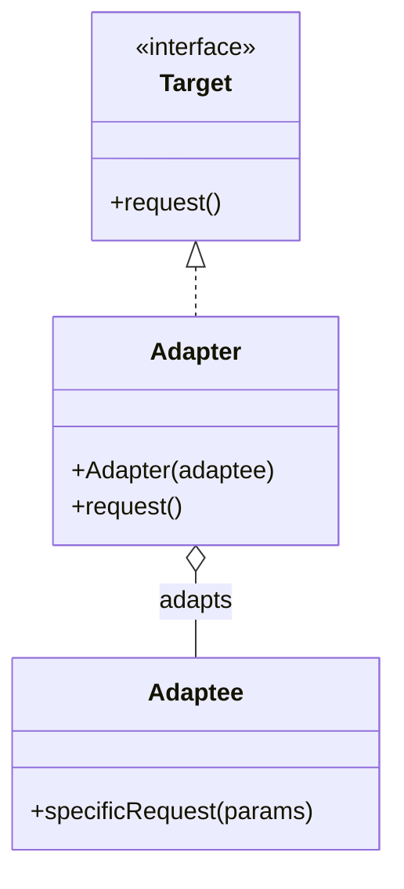

Hello! I'm Pan-kun.

This post covers the Adapter pattern from the GoF (Gang of Four) design patterns.  
I explain it practically, including a C++ sample, how to implement it, when to use it, pitfalls to watch out for, and a Mermaid diagram for visualization.  

## Introduction

The Adapter pattern provides a wrapper that connects incompatible interfaces, allowing an existing class to be adapted to the interface expected by clients.  

Benefits:  
- You can adapt existing code or third-party libraries to a new interface without changing their implementation.

Drawbacks:  
- Proliferation of wrappers can scatter design responsibilities and reduce readability and maintainability.
- The added indirection can also introduce runtime overhead.

## Use cases

Common scenarios where you would create an Adapter include:  

- Integrating a legacy API or library into a new application interface.
- When different modules expose incompatible interfaces but you cannot modify the existing implementation.
- Creating a thin boundary that makes it easy to swap implementations during testing (though using mocks can be simpler when applicable).

## Structure

An Adapter implements the Target interface and internally invokes the Adaptee's operations while performing any required conversions.  



## C++ implementation example

Below is a concise C++ example.  

```cpp
// Example: the client expects to call Target::request()
struct Target {
    virtual ~Target() = default;
    virtual void request() = 0; // method the client expects
};

// Existing (unchangeable) class
class Adaptee {
public:
    void specificRequest(const std::string& params) {
        // Complex call in an existing API
        std::cout << "Adaptee::specificRequest with " << params << std::endl;
    }
};

// Adapter: implements Target while adapting Adaptee
class Adapter : public Target {
public:
    explicit Adapter(std::shared_ptr<Adaptee> adaptee)
        : adaptee_(std::move(adaptee)) {}

    void request() override {
        // Perform necessary translation before calling adaptee
        std::string translated = translate();
        adaptee_->specificRequest(translated);
    }

private:
    std::string translate() {
        // Actual translation logic; simplified here.
        return "translated-params";
    }

    std::shared_ptr<Adaptee> adaptee_;
};

// main.cpp usage
auto adaptee = std::make_shared<Adaptee>();
std::unique_ptr<Target> target = std::make_unique<Adapter>(adaptee);
target->request(); // the client only knows Target
```

Key points:  
- Perform data-format conversion, error handling, and method mapping as needed.
- There are inheritance-based and delegation-based adapters; choose according to your use case.  
  In short: inheritance-based adapters leverage class inheritance, while delegation-based adapters implement an interface and forward calls to a contained object.  

## Implementation notes

1. Keep translations simple
   - Avoid loading the Adapter with excessive logic or business rules; that inflates its responsibility.
   - If possible, extract translation logic into a separate module.

2. Make ownership and lifecycle explicit
   - In C++, pointer types determine the relationship between Adapter and Adaptee.
   - Manage ownership clearly to avoid leaks and double frees.

3. Consider performance
   - Heavy translations on hot paths become performance bottlenecks.
   - Consider caching translated results when appropriate.

4. Preserve testability
   - A thin Adapter is easier to unit-test.
   - Make Adaptee mockable where practical.

5. Provide logging and robust error handling

## Common anti-patterns

Typical bad practices when applying this pattern:

- Putting substantial domain logic into the Adapter.
- Adding Adapter layers indiscriminately across a project, deepening call chains.
- Ignoring semantics lost during conversion or exceptional cases thrown by the adaptee.

## Practical adoption checklist

- Can you modify the existing code directly? If not, an Adapter is a reasonable choice.
- Is the translation logic simple? If it's complex, consider an intermediary service or a Facade.
- Do frequency and performance constraints tolerate the translation cost? If not, evaluate alternative designs.
- Is there a test strategy? Ensure you can use mocks or integration tests as needed.

## Conclusion

The Adapter is a practical and commonly used pattern for bridging incompatible interfaces. However, careless proliferation of Adapters can complicate design. Make responsibilities explicit and localize translation logic when you use this pattern.  
Pay special attention to ownership, exception and error handling, performance, and testability when implementing an Adapter.  

References:

[!CARD](https://sourcemaking.com/design_patterns/adapter)

[!CARD](https://en.wikipedia.org/wiki/Adapter_pattern)

That's it for now — next time I'll cover another GoF pattern.  
The examples in this article are simplified for learning purposes; evaluate them carefully against your requirements before adopting them in production.  

Thanks for reading — Pan-kun!
