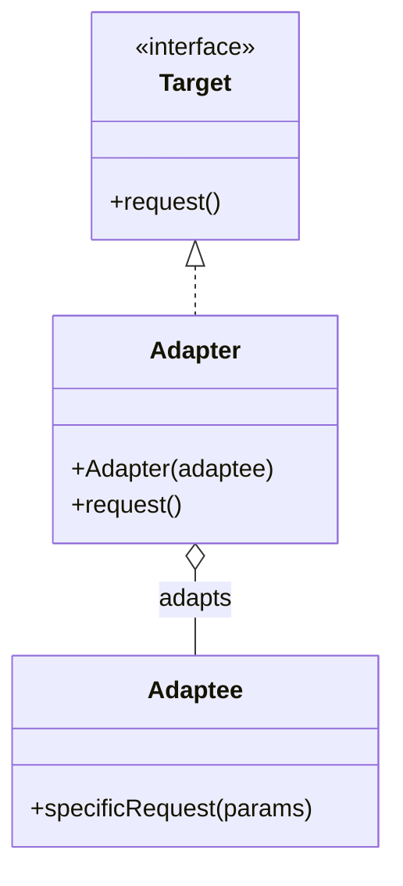

こんにちは、パン君です。

今回は GoF（Gang of Four）のデザインパターンのアダプタ編になります。   
サンプルコード（C++）、作り方、使うタイミング、注意点、mermaid図による可視化などを含めて実用的に解説します。  

## はじめに

アダプタは互換性のないインターフェース同士をつなぐ ラッパー を提供し、クライアントが期待するインターフェースに既存のクラスを適合させるためのデザインパターンです。

利点としては  
既存コードや外部ライブラリを変更せずに新しいインターフェースへ適合できることです。

欠点は  
ラッパーが増えると設計が分散し可読性や保守性の低下を招くことです。  
また、間接化によるランタイムのコスト増も発生します。

## ユースケース

代表的に下記のようなケースで作成されるパターンです。　　

- 古い API / ライブラリを新しいアプリケーションインターフェースに統合したいとき。  
- 異なるモジュール間でインターフェースの不一致があるが、既存実装を変更できないとき。  
- テスト時に実装を差し替えるための薄い境界を作りたいとき（ただし Mock を使える場合はそちらの方が簡潔な場合もある）。

## 構造

Adapter は Target のインターフェースを実装し、内部で Adaptee の操作を呼び出して必要な変換を行います。



## C++ 実装パターン

以下は簡潔な C++ の例です。

```cpp
// 例: クライアントは Target::request() を使うことを期待している
struct Target {
    virtual ~Target() = default;
    virtual void request() = 0; // クライアントが期待するメソッド
};

// 既存の（変更できない）クラス
class Adaptee {
public:
    void specificRequest(const std::string& params) {
        // 既存 API の複雑な呼び出し
        std::cout << "Adaptee::specificRequest with " << params << std::endl;
    }
};

// Adapter: Target を実装しつつ Adaptee を適合させる
class Adapter : public Target {
public:
    explicit Adapter(std::shared_ptr<Adaptee> adaptee)
        : adaptee_(std::move(adaptee)) {}

    void request() override {
        // 必要な変換を行ってから adaptee を呼ぶ
        std::string translated = translate();
        adaptee_->specificRequest(translated);
    }

private:
    std::string translate() {
        // 実際の変換ロジック。ここでは単純化。
        return "translated-params";
    }

    std::shared_ptr<Adaptee> adaptee_;
};

// main.cpp
auto adaptee = std::make_shared<Adaptee>();
std::unique_ptr<Target> target = std::make_unique<Adapter>(adaptee);
target->request(); // クライアントは Target のみを意識する
```

ポイントとして  
必要に応じてデータ形式の変換、エラーハンドリング、複数メソッドのマッピングを行うようにしましょう。  
また、継承ベースと委譲ベースがありますが、ユースケースに寄って使い分けしてください。  
端的に説明すると、継承ベースはクラスの継承を活用し、委譲ベースはインターフェースの実装です。  

## 実装上の注意点

1. 単純な変換に留める  
   Adapter に過度のロジックやビジネスルールを詰め込みすぎると責務が肥大化します。  
   可能なら変換ロジックは別モジュールに切り出しましょう。  
2. 所有権とライフサイクルを明確にする  
   C++ ではポインタの種類により Adapter と Adaptee の関係が変わります。  
   リーク・二重解放を避けるために明示的に管理しましょう。    
3. パフォーマンスの考慮  
   頻繁に呼ばれるパスで重い変換を行うと性能ボトルネックになります。  
   必要なら変換済みキャッシュを検討しましょう。    
4. テストしやすさを保つ  
   Adapter を薄く保つことで単体テストが簡単になります。  
   Adaptee をモック可能にしておくと良いです。    
5. ログ・エラーハンドリングを整備する  

## よくあるアンチパターン

下記はこのデザインパターンを利用する際に起きる悪い例です。

- Adapter に大量のドメインロジックを入れる。  
- プロジェクト全体で無差別に Adapter 層を追加してしまい、呼び出しチェーンが深くなる。  
- 変換で失われる意味や例外ケースを無視する。

## 実務での採用判断チェックリスト

- 既存コードを直接変更できないか？（変更不可なら Adapter が妥当）  
- 変換ロジックは単純か？ 複雑なら中間サービスやファサードでの整理が必要か？  
- 頻度・性能要件は許容できるか？（変換コストが高ければ別設計を検討）  
- テスト戦略は確立できるか？（Mock や Integration テストの整備）

## まとめ

アダプタは「互換性のないインターフェースを橋渡しする」ための実用的かつよく使われるパターンです。  
ただし、Adapter を安易に量産すると設計が複雑化するため、責務を明確にし変換ロジックを局所化して使うことが重要です。  
実装では所有権、例外・エラー、性能、テストのしやすさを特に注意してください。  

参考・出典を記します

[!CARD](https://sourcemaking.com/design_patterns/adapter)

[!CARD](https://en.wikipedia.org/wiki/Adapter_pattern )

それでは、次回は別の GoF パターンについても解説していきます。  
この記事で紹介した実装は学習目的に簡素化しています。  
実プロダクションで採用する際は要件に合わせて十分に検討してください。  

以上、パン君でした！
