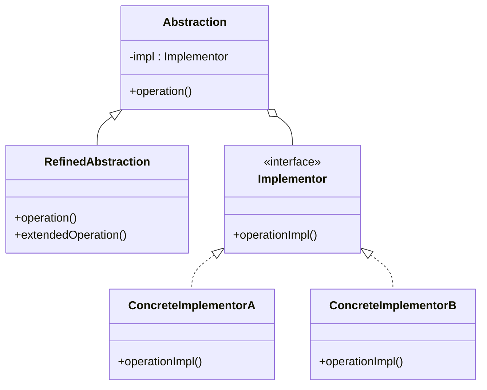

Hello! I'm Pan-kun.

This article covers the Bridge pattern from the GoF (Gang of Four) design patterns.  
I explain it practically, including sample code (C++), how to build it, when to use it, and important caveats.  

## Introduction

The Bridge pattern separates an abstraction from its implementation so the two can vary independently.  
When you use class inheritance, abstraction and implementation often become tightly coupled.  
The Bridge pattern provides a flexible alternative that lets you change either side without affecting the other.  

> The Bridge pattern is a software design pattern defined by the Gang of Four. It decouples an abstraction from its implementation so that the two can vary independently.  
>  
> Source: [Bridge pattern - Wikipedia](https://en.wikipedia.org/wiki/Bridge_pattern)

[!CARD](https://en.wikipedia.org/wiki/Bridge_pattern)

## Use Cases

Here are some typical situations where you might consider applying the Bridge pattern:  

**When you do not want to permanently bind abstraction and implementation.**  
  Useful if you need to select or switch implementations at runtime.  
**When you need to extend both the abstraction hierarchy and the implementation hierarchy.**  
  Keeps the number of classes under control by managing extension at independent layers.  
**When you want implementation changes to have minimal impact on clients.**  
  Hides implementation details and can minimize recompilation scope (in C++ this is related to the Pimpl idiom).  
**When many classes share similar implementation with small variations.**  
  Splitting the feature hierarchy from the implementation hierarchy reduces code duplication.  

## Structure

To implement the Bridge pattern you typically create four roles of classes:  

1. **Abstraction**
   - The top-level class in the feature hierarchy.
   - Holds a reference to an `Implementor` and delegates work to it.
2. **RefinedAbstraction**
   - Inherits from `Abstraction` and adds or refines behavior.
   - Defines concrete combinations of feature behavior.
3. **Implementor**
   - The top-level interface (or abstract class) for the implementation hierarchy.
   - Defines the low-level API used by `Abstraction`.
4. **ConcreteImplementor**
   - Implements the `Implementor` interface concretely.
   - Contains platform-specific or library-dependent code.

Below is a UML representation. Notice the separation between the feature (abstraction) class hierarchy and the implementation class hierarchy — they are literally bridged.  



## C++ Implementation Example

Here we use a drawing example.  
We separate the abstract concept of a "shape" from a concrete "drawing API" implementation.  

This lets you add new shapes (e.g., rectangles, circles) on the shape side or add new drawing methods (e.g., OpenGL, DirectX) on the implementation side without changing the other.  

```cpp
// Drawing API interface
class DrawingAPI {
public:
    virtual ~DrawingAPI() = default;
    virtual void drawCircle(double x, double y, double radius) = 0;
};

// Concrete Drawing API 1
class DrawingAPI1 : public DrawingAPI {
public:
    void drawCircle(double x, double y, double radius) override {
        std::cout << "API1.circle at " << x << ":" << y << " radius " << radius << std::endl;
    }
};

// Concrete Drawing API 2
class DrawingAPI2 : public DrawingAPI {
public:
    void drawCircle(double x, double y, double radius) override {
        std::cout << "API2.circle at " << x << ":" << y << " radius " << radius << std::endl;
    }
};

// Abstract shape class
class Shape {
protected:
    DrawingAPI* drawingAPI; // holds reference to Implementor

public:
    Shape(DrawingAPI* api) : drawingAPI(api) {}
    virtual ~Shape() = default;

    virtual void draw() = 0; // high-level operation
    virtual void resizeByPercentage(double pct) = 0; // high-level operation
};

// Concrete shape: circle
class CircleShape : public Shape {
private:
    double x, y, radius;

public:
    CircleShape(double x, double y, double radius, DrawingAPI* api)
        : Shape(api), x(x), y(y), radius(radius) {}

    void draw() override {
        // Delegate actual drawing to the drawingAPI implementation
        drawingAPI->drawCircle(x, y, radius);
    }

    void resizeByPercentage(double pct) override {
        radius *= (1.0 + pct / 100.0);
    }
};

int main() {
    DrawingAPI1 api1;
    DrawingAPI2 api2;

    // Same conceptual "circle" but instantiated with different drawing APIs
    CircleShape circle1(1, 2, 3, &api1);
    CircleShape circle2(5, 7, 11, &api2);

    circle1.resizeByPercentage(10);
    circle2.resizeByPercentage(10);

    std::cout << "--- Circle 1 with API 1 ---" << std::endl;
    circle1.draw();

    std::cout << "--- Circle 2 with API 2 ---" << std::endl;
    circle2.draw();

    return 0;
}

// Output
// --- Circle 1 with API 1 ---
// API1.circle at 1:2 radius 3.3
// --- Circle 2 with API 2 ---
// API2.circle at 5:7 radius 12.1
```

In this example, `Shape` holds a pointer to a `DrawingAPI`.  
When `CircleShape::draw` is invoked, the actual drawing logic is delegated to the `DrawingAPI` implementation.  

## Advantages / Disadvantages

### Advantages

- **Implementation hiding and reduced dependencies**  
  Client code needs to know only the abstraction (`Abstraction`) and not the implementation details. This can shorten compile times and enable looser coupling.  
- **Improved extensibility**  
  You can extend the feature hierarchy and the implementation hierarchy independently. Adding a new feature doesn't affect implementation classes, and adding a new implementation doesn't affect feature classes.  
- **Runtime implementation switching**  
  By replacing the `Implementor` object at runtime you can change behavior dynamically.  

### Disadvantages

- **Increased design complexity**  
  For small systems where simple inheritance is sufficient, Bridge can increase the number of classes and unnecessarily complicate the structure.  
- **Potentially reduced readability**  
  Because behavior is delegated from the abstraction to implementation classes, understanding the full behavior may require navigating multiple classes, which can make the code less intuitive.  

## Conclusion

The Bridge pattern is a powerful technique to keep systems flexible by separating feature extension from implementation extension.  
It truly shines in large projects where future change requirements are unclear.  
However, it can be overengineering for small projects; a good rule is to introduce it when you actually see class explosion or when refactoring for clearer separation.  

References:

[!CARD](https://en.wikipedia.org/wiki/Bridge_pattern)

That's all for now — next time I'll cover another GoF pattern.  
The sample implementations shown here are simplified for learning purposes. Evaluate carefully before adopting them in production.  

Thanks for reading — Pan-kun!
