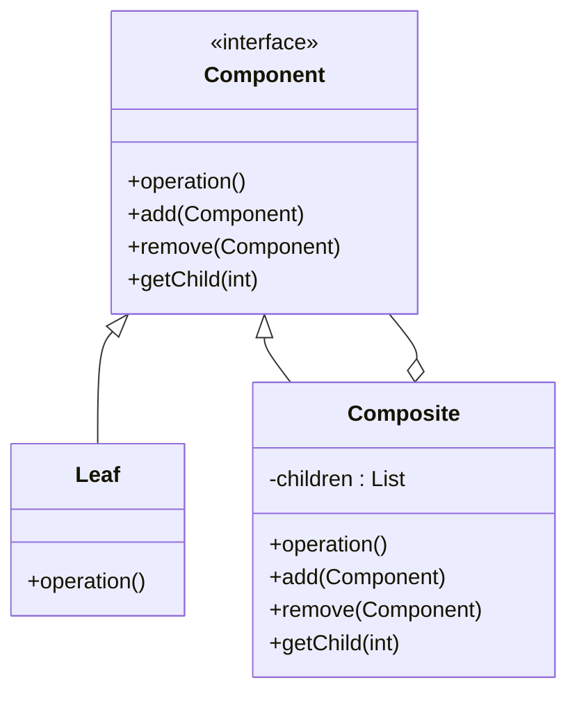

こんにちは！パン君です。  

今回は GoF（Gang of Four）のデザインパターンのコンポジット編になります。  
サンプルコード（C++）、作り方、使うタイミング、注意点などを含めて実用的に解説します。   

## はじめに

コンポジットパターンとは **全体と部分を同一視する** 構造を持たせるためのパターンです。  
ファイルシステム（フォルダとファイル）のように、再帰的な構造を扱う際、クライアントが個々のオブジェクトと合成されたオブジェクトを区別なく扱えるようにします。

> Composite パターン（コンポジット・パターン）とは、GoF（Gang of Four; 4人のギャングたち）によって定義された。ソフトウェア開発に使われるデザインパターンの1つである。  
> 木構造の要素を、個々のオブジェクトおよび合成されたオブジェクトで同じように扱えるようにする。
>
> 出典: [Composite パターン - Wikipedia](https://ja.wikipedia.org/wiki/Composite_%E3%83%91%E3%82%BF%E3%83%BC%E3%83%B3)

[!CARD](https://ja.wikipedia.org/wiki/Composite_%E3%83%91%E3%82%BF%E3%83%BC%E3%83%B3)  

## ユースケース

採用を検討する状況の例としていくつかあげます。  

- **木構造のデータを扱う必要がある場合**  
  ファイルシステム、GUIのウィジェット、組織図など、階層構造を持つデータを表現するのに適しています。
- **クライアントコードが「部分」と「全体」を区別せずに扱いたい場合**  
  単一のオブジェクトに対する操作と、複数のオブジェクトの集合に対する操作を同じインターフェースで実行したい場合に便利です。
- **再帰的な処理を簡潔に書きたい場合**  
  複雑なツリー構造に対して、一律の操作を再帰的に伝播させる処理を実装しやすくなります。

## 構造

Compositeパターンを実装するには、以下の3つの役割を持つクラスが必要です。

1.  **Component（構成要素）**
    *   すべての要素（LeafとComposite）に共通のインターフェースを定義します。
    *   クライアントはこのインターフェースを通じて要素を操作します。
2.  **Leaf（葉）**
    *   子要素を持たない、木の末端にある要素です。
    *   Componentインターフェースの実際の振る舞いを実装します。
3.  **Composite（複合体）**
    *   子要素（Leafや他のComposite）を持つ要素です。
    *   子要素を管理するメソッド（追加、削除など）を持ち、Componentインターフェースの操作を子要素に委譲します。

下記はこれらをUMLで表しました。  
**Leaf**と**Composite**が同じ**Component**インターフェースを実装しているため、再帰的な構造が作られます。



## C++ 実装例

ここではファイルシステム（ディレクトリとファイル）を例に挙げます。  
**ファイル**（Leaf）と**ディレクトリ**（Composite）を同一視して、サイズ計算などの操作を行います。  

これにより、ディレクトリの中にファイルがあっても、さらにディレクトリがあっても、再帰的にサイズを計算することができます。

```cpp
#include <iostream>
#include <vector>
#include <string>
#include <algorithm>
#include <memory>

// Component: ファイルとディレクトリの共通インターフェース
class FileSystemUnit {
protected:
    std::string name;

public:
    FileSystemUnit(const std::string& name) : name(name) {}
    virtual ~FileSystemUnit() = default;

    // 共通の操作
    virtual int getSize() const = 0;
    virtual void printList(const std::string& prefix = "") const = 0;

    // 子要素管理（デフォルトでは何もしないかエラー）
    virtual void add(std::shared_ptr<FileSystemUnit> unit) {
        // Leafではサポートしないため、デフォルト実装は空または例外でも良い
    }
};

// Leaf: 個別のファイル
class File : public FileSystemUnit {
private:
    int size;

public:
    File(const std::string& name, int size) : FileSystemUnit(name), size(size) {}

    int getSize() const override {
        return size;
    }

    void printList(const std::string& prefix = "") const override {
        std::cout << prefix << "/" << name << " (" << size << "KB)" << std::endl;
    }
};

// Composite: ディレクトリ
class Directory : public FileSystemUnit {
private:
    std::vector<std::shared_ptr<FileSystemUnit>> children;

public:
    Directory(const std::string& name) : FileSystemUnit(name) {}

    int getSize() const override {
        int totalSize = 0;
        for (const auto& child : children) {
            totalSize += child->getSize();
        }
        return totalSize;
    }

    void printList(const std::string& prefix = "") const override {
        std::cout << prefix << "/" << name << " (Total: " << getSize() << "KB)" << std::endl;
        for (const auto& child : children) {
            child->printList(prefix + "/" + name);
        }
    }

    void add(std::shared_ptr<FileSystemUnit> unit) override {
        children.push_back(unit);
    }
};

int main() {
    // ディレクトリ構造の作成
    auto root = std::make_shared<Directory>("root");
    auto bin = std::make_shared<Directory>("bin");
    auto tmp = std::make_shared<Directory>("tmp");
    auto usr = std::make_shared<Directory>("usr");

    auto vi = std::make_shared<File>("vi", 100);
    auto latex = std::make_shared<File>("latex", 200);

    root->add(bin);
    root->add(tmp);
    root->add(usr);

    bin->add(vi);
    bin->add(latex);
    
    // さらに深い階層
    auto local = std::make_shared<Directory>("local");
    usr->add(local);
    local->add(std::make_shared<File>("myscript.sh", 10));

    // 全体の表示とサイズ計算
    // クライアントは root が Composite か Leaf かを気にせず操作できる
    std::cout << "--- File System List ---" << std::endl;
    root->printList();
    
    return 0;
}

// 実行結果
// --- File System List ---
// /root (Total: 310KB)
// /root/bin (Total: 300KB)
// /root/bin/vi (100KB)
// /root/bin/latex (200KB)
// /root/tmp (Total: 0KB)
// /root/usr (Total: 10KB)
// /root/usr/local (Total: 10KB)
// /root/usr/local/myscript.sh (10KB)
```

この例では `FileSystemUnit` が Component の役割を果たし、`File` と `Directory` がそれぞれ Leaf と Composite になります。  
`Directory::getSize()` は自身の子要素の `getSize()` を呼び出し、それが再帰的に行われることで全体のサイズが計算されます。

## メリット / デメリット

### メリット

- **クライアントコードの単純化**
  クライアントは個々のオブジェクトと合成オブジェクトを区別する必要がありません。条件分岐（if-else や switch）を減らし、ポリモーフィズムを活用したコードが書けます。
- **新しい種類の要素の追加が容易**
  新しい Leaf や Composite クラスを追加しても、既存のコードを変更する必要がほとんどありません（Open/Closed Principle）。
- **再帰構造の表現力**
  複雑なツリー構造を直感的に表現でき、全体に対する操作を簡単に実装できます。

### デメリット

- **設計の一般化**
  Component インターフェースに、Leaf にとっては無意味なメソッド（`add` や `remove` など）が含まれる場合があります。これにより、型安全性の一部が損なわれる可能性があります（Liskov Substitution Principle への配慮が必要）。
- **制約の難しさ**
  Composite が特定の種類の子要素しか持てないように制限したい場合、静的な型チェックだけでは難しく、実行時のチェックが必要になることがあります。

## まとめ

コンポジットパターンは**再帰的な木構造**を扱う際に非常に強力なパターンです。  
「部分」と「全体」を同一視することで、クライアントコードをシンプルに保ちながら、複雑な構造に対する操作を一貫して行うことができます。  

ただし、Leaf に対して子要素管理メソッドをどう扱うか（例外を投げるか、何もしないか）は設計上のトレードオフになるため、要件に応じて適切に判断する必要があります。

参考・出典を記します  

[!CARD](https://refactoring.guru/design-patterns/composite)  

それでは、次回は別の GoF パターンについても解説していきます。  
この記事で紹介した実装は学習目的に簡素化しています。  
実プロダクションで採用する際は要件に合わせて十分に検討してください。  

以上、パン君でした！