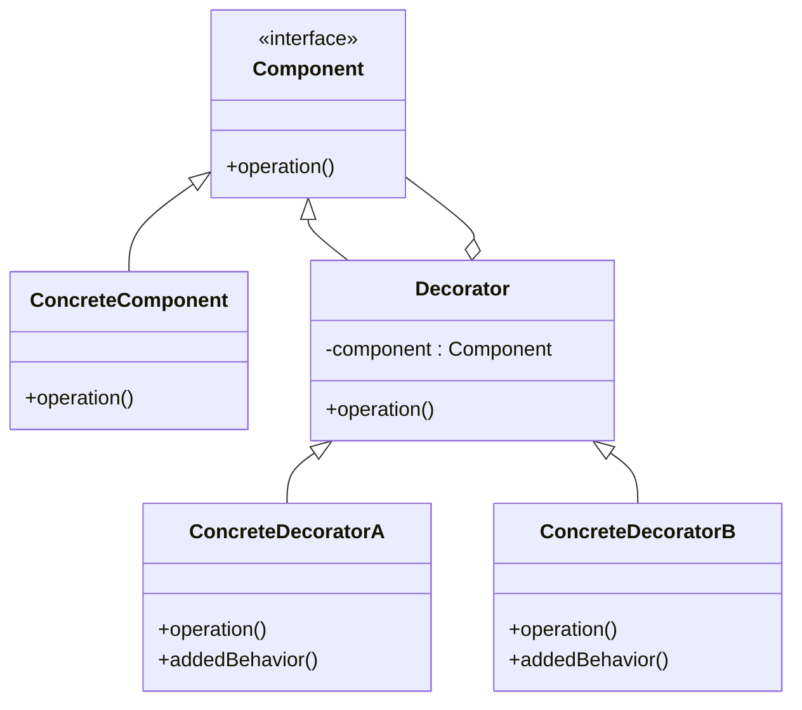

こんにちは！パン君です。  

今回は GoF（Gang of Four）のデザインパターンのデコレータ編になります。  
サンプルコード（C++）、作り方、使うタイミング、注意点などを含めて実用的に解説します。   

## はじめに

デコレータ（Decorator）パターンとは、**オブジェクトに対して動的に新しい機能や振る舞いを追加する**ためのパターンです。  
サブクラス化（継承）による機能拡張の代替として、柔軟な機能の組み合わせを可能にします。

> Decorator パターン（デコレータ・パターン）とは、GoF（Gang of Four; 4人のギャングたち）によって定義された。ソフトウェア開発に使われるデザインパターンの1つである。  
> 既存のオブジェクトに新しい機能や振る舞いを動的に追加することを可能にする。
>
> 出典: [Decorator パターン - Wikipedia](https://ja.wikipedia.org/wiki/Decorator_%E3%83%91%E3%82%BF%E3%83%BC%E3%83%B3)

[!CARD](https://ja.wikipedia.org/wiki/Decorator_%E3%83%91%E3%82%BF%E3%83%BC%E3%83%B3)  

## ユースケース

採用を検討する状況の例としていくつかあげます。  

- **動的に機能を追加・削除したい場合**  
  実行時にオブジェクトに対して責任（機能）を動的かつ透過的に追加したい場合に適しています。
- **サブクラスの爆発を防ぎたい場合**  
  様々な機能の組み合わせをすべて継承で実装しようとすると、クラスの数が爆発的に増えてしまいます。デコレータを使えば、複数の小さなデコレータを組み合わせることで柔軟に対応できます。
- **クラスの定義を変更せずに拡張したい場合**  
  既存のコード（特にライブラリなど変更できないクラス）の振る舞いを拡張したい場合に便利です。

## 構造

Decoratorパターンを実装するには、以下の役割を持つクラスが必要です。

1.  **Component（構成要素）**
    *   機能を追加されるオブジェクトの共通インターフェースを定義します。
2.  **ConcreteComponent（具体的な構成要素）**
    *   `Component`インターフェースを実装した基本となるクラスです。これに対して機能が追加されます。
3.  **Decorator（装飾者）**
    *   `Component`インターフェースを実装し、さらに内部に`Component`の参照を保持します。
    *   操作を保持している`Component`に委譲します。
4.  **ConcreteDecorator（具体的な装飾者）**
    *   `Decorator`のサブクラスで、実際の新しい機能や状態を追加します。

下記はこれらをUMLで表しました。  



## C++ 実装例

ここでは、カフェの飲み物（Beverage）の注文システムを例に挙げます。  
ベースとなる**エスプレッソ**（ConcreteComponent）に対して、**モカ**や**ホイップクリーム**（ConcreteDecorator）を動的に追加して、説明文と価格を更新します。

```cpp
#include <iostream>
#include <string>
#include <memory>

// Component: 飲み物の共通インターフェース
class Beverage {
public:
    virtual ~Beverage() = default;
    virtual std::string getDescription() const = 0;
    virtual double cost() const = 0;
};

// ConcreteComponent: ベースとなる飲み物（エスプレッソ）
class Espresso : public Beverage {
public:
    std::string getDescription() const override {
        return "Espresso";
    }
    double cost() const override {
        return 1.99;
    }
};

// Decorator: 装飾者の基底クラス
class CondimentDecorator : public Beverage {
protected:
    std::shared_ptr<Beverage> beverage; // ラップするComponentを保持
public:
    CondimentDecorator(std::shared_ptr<Beverage> beverage) : beverage(beverage) {}
    
    std::string getDescription() const override {
        return beverage->getDescription();
    }
    double cost() const override {
        return beverage->cost();
    }
};

// ConcreteDecorator: 具体的なトッピング（モカ）
class Mocha : public CondimentDecorator {
public:
    Mocha(std::shared_ptr<Beverage> beverage) : CondimentDecorator(beverage) {}
    
    std::string getDescription() const override {
        return beverage->getDescription() + ", Mocha";
    }
    double cost() const override {
        return beverage->cost() + 0.20;
    }
};

// ConcreteDecorator: 具体的なトッピング（ホイップ）
class Whip : public CondimentDecorator {
public:
    Whip(std::shared_ptr<Beverage> beverage) : CondimentDecorator(beverage) {}
    
    std::string getDescription() const override {
        return beverage->getDescription() + ", Whip";
    }
    double cost() const override {
        return beverage->cost() + 0.10;
    }
};

int main() {
    // 1. ベースのエスプレッソを注文
    std::shared_ptr<Beverage> myDrink = std::make_shared<Espresso>();
    std::cout << myDrink->getDescription() << " $" << myDrink->cost() << std::endl;

    // 2. モカを追加 (エスプレッソをラップ)
    myDrink = std::make_shared<Mocha>(myDrink);
    std::cout << myDrink->getDescription() << " $" << myDrink->cost() << std::endl;

    // 3. さらにホイップを追加 (モカでラップされたエスプレッソをさらにラップ)
    myDrink = std::make_shared<Whip>(myDrink);
    std::cout << myDrink->getDescription() << " $" << myDrink->cost() << std::endl;

    return 0;
}

// 実行結果
// Espresso $1.99
// Espresso, Mocha $2.19
// Espresso, Mocha, Whip $2.29
```

この例では、`Beverage`インターフェースを実装したデコレータが、別の`Beverage`オブジェクトをラップしています。これにより、既存のクラスを変更せずにトッピングを何層にも重ねることが可能です。

## メリット / デメリット

### メリット

- **サブクラス化より柔軟な拡張**
  継承を使わずに、実行時に機能を追加・削除できます。
- **クラスの爆発を防止**
  様々な機能の組み合わせが必要な場合でも、クラス数を少なく保つことができます（複数のデコレータを組み合わせるだけ）。
- **単一責任の原則（SRP）の遵守**
  1つのクラスにすべての機能を持たせるのではなく、各デコレータが1つの機能に集中できます。

### デメリット

- **細かいオブジェクトが多数生成される**
  多数の小さなデコレータクラスが導入されるため、全体を把握しにくくなる場合があります。
- **デコレータの順序に依存する設計になりがち**
  装飾の順番が結果に影響を与える場合、バグの温床になり得ます。
- **特定のオブジェクトの型に依存したコードが書きにくくなる**
  デコレータでラップされると型が隠蔽されるため、特定の `ConcreteComponent` のメソッドに直接アクセスすることが難しくなります。

## まとめ

デコレータパターンは、オブジェクトの機能を**継承ではなく委譲（コンポジション）**を使って柔軟に拡張するための強力なパターンです。  
GUIツールキット（スクロールバー付きのウィンドウなど）やI/Oストリーム（Javaの `java.io` など）で広く採用されています。

ただし、過剰に使用するとシステムの理解を妨げる小さなオブジェクト群を生み出すため、本当に動的な拡張が必要かを考慮して採用してください。

参考・出典を記します  

[!CARD](https://refactoring.guru/ja/design-patterns/decorator)  

それでは、次回は別の GoF パターンについても解説していきます。  
この記事で紹介した実装は学習目的に簡素化しています。  
実プロダクションで採用する際は要件に合わせて十分に検討してください。  

以上、パン君でした！
