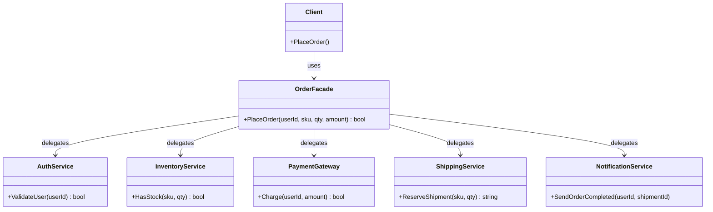

こんにちは！パン君です。  

今回は GoF（Gang of Four）のデザインパターンのファサード編になります。  
サンプルコード（C++）、作り方、使うタイミング、注意点などを含めて実用的に解説します。  

## はじめに

ファサード（Facade）パターンとは、**複雑なサブシステムに対して、シンプルな窓口（単純なインターフェース）を提供する**ための構造パターンです。  
クライアント側は多数のクラスや呼び出し順を意識せず、ファサードだけを呼べば目的を達成できます。  

一次情報として、Wikipedia には次のように記載されています。  

> "The facade pattern ... is an object that serves as a front-facing interface masking more complex underlying or structural code."  
> （出典: [https://en.wikipedia.org/wiki/Facade_pattern](https://en.wikipedia.org/wiki/Facade_pattern)）

また Refactoring.Guru では意図が次のように明示されています。  

> "Facade is a structural design pattern that provides a simplified interface to a library, a framework, or any other complex set of classes."  
> （出典: [https://refactoring.guru/design-patterns/facade](https://refactoring.guru/design-patterns/facade)）

[!CARD](https://en.wikipedia.org/wiki/Facade_pattern)

[!CARD](https://refactoring.guru/design-patterns/facade)

## ユースケース

採用を検討する代表例です。  

- **外部SDKやライブラリが複雑な場合**  
  初期化・認証・実行・後処理の順序をファサード内に閉じ込める。  
- **レイヤー間の依存を減らしたい場合**  
  画面層からサブシステム詳細へ直接アクセスさせず、窓口を固定する。  
- **モノリシックなコードを段階的に整理したい場合**  
  まず既存呼び出しをファサード経由に寄せることで、後続リファクタリングの影響範囲を局所化できる。  

## 構造

Facadeパターンの基本要素はシンプルです。  

1. **Client**  
   ファサードだけを利用する呼び出し側。  
2. **Facade**  
   サブシステムの複数APIをまとめ、必要な手順を調停して単純な操作として公開する。  
3. **Subsystem Classes**  
   実処理を担う既存クラス群。ファサードの存在を知らないことが多い。  



## C++ 実装例

ここでは「注文確定」を例にします。  
クライアントは `OrderFacade::PlaceOrder` を1回呼ぶだけで、認証・在庫確認・決済・配送予約・通知まで完了します。  

```cpp
#include <iostream>
#include <string>

class AuthService {
public:
    bool ValidateUser(const std::string& userId) const {
        return !userId.empty();
    }
};

class InventoryService {
public:
    bool HasStock(const std::string& sku, int qty) const {
        return !sku.empty() && qty > 0; // 学習用に簡略化
    }
};

class PaymentGateway {
public:
    bool Charge(const std::string& userId, int amount) const {
        return !userId.empty() && amount > 0;
    }
};

class ShippingService {
public:
    std::string ReserveShipment(const std::string& sku, int qty) const {
        if (sku.empty() || qty <= 0) return "";
        return "SHIP-20260529-001";
    }
};

class NotificationService {
public:
    void SendOrderCompleted(const std::string& userId, const std::string& shipmentId) const {
        std::cout << "Notify user=" << userId << " shipment=" << shipmentId << "\n";
    }
};

class OrderFacade {
public:
    bool PlaceOrder(const std::string& userId,
                    const std::string& sku,
                    int qty,
                    int amount) {
        if (!auth_.ValidateUser(userId)) {
            std::cout << "auth failed\n";
            return false;
        }
        if (!inventory_.HasStock(sku, qty)) {
            std::cout << "out of stock\n";
            return false;
        }
        if (!payment_.Charge(userId, amount)) {
            std::cout << "payment failed\n";
            return false;
        }

        const std::string shipmentId = shipping_.ReserveShipment(sku, qty);
        if (shipmentId.empty()) {
            std::cout << "shipping failed\n";
            return false;
        }

        notifier_.SendOrderCompleted(userId, shipmentId);
        return true;
    }

private:
    AuthService auth_;
    InventoryService inventory_;
    PaymentGateway payment_;
    ShippingService shipping_;
    NotificationService notifier_;
};

int main() {
    OrderFacade facade;

    const bool ok = facade.PlaceOrder(
        "user-001",  // userId
        "sku-coffee",// sku
        2,            // qty
        1800          // amount
    );

    std::cout << (ok ? "order success" : "order failed") << "\n";
    return 0;
}

// 実行例
// Notify user=user-001 shipment=SHIP-20260529-001
// order success
```

ポイントは、クライアントがサブシステムを直接触らない点です。  
サブシステム側の詳細変更（例: 決済SDK差し替え）が起きても、クライアント影響を `OrderFacade` に閉じ込められます。  

## メリット / デメリット

### メリット

- **依存関係を削減できる**  
  クライアントは多数のサブシステムではなく、ファサード1つに依存すればよい。  
- **利用手順を統一できる**  
  呼び出し順のばらつきや呼び忘れを防ぎやすい。  
- **変更の局所化**  
  サブシステム更新時の変更をファサードに集中させやすい。  

### デメリット

- **ファサード肥大化のリスク**  
  何でも集約すると God Object 化して保守性が落ちる。  
- **機能が隠れすぎる可能性**  
  単純APIの裏側で何が起きるか見えづらく、デバッグが難しくなる場合がある。  

## 似たパターンとの違い

- **Adapter**: 既存インターフェースを「別の期待インターフェースに変換」する。  
- **Decorator**: 同じインターフェースのまま責務を「動的に追加」する。  
- **Facade**: 複数クラス群へのアクセスを「単純な窓口に集約」する。  

GoF記事の流れで言うと、Adapter/Decorator と並ぶ構造パターンですが、目的は明確に異なります。  

## 実務での注意点

- ファサードに**業務ロジックを過剰に入れない**（本質は「窓口」）。  
- ユースケース単位でファサードを分割する（例: `OrderFacade`, `BillingFacade`）。  
- 例外/エラー方針を統一して、クライアントへ返す契約を明確にする。  
- まずは入口を一本化し、その後にサブシステム内部を改善する段階的リファクタリングを意識する。  

## まとめ

ファサードパターンは、**複雑なサブシステムに対するシンプルな入口**を提供し、クライアントの依存と実装負担を下げる実務的なパターンです。  
特に「SDKが複雑」「呼び出し順が煩雑」「境界を明確化したい」といった現場で効果を発揮します。  

一方で、単一ファサードへの責務集中には注意が必要です。  
機能単位で分割しつつ、窓口としての責務に絞って運用すると長期的に保守しやすくなります。  

参考・出典を記します  

[!CARD](https://en.wikipedia.org/wiki/Facade_pattern)

[!CARD](https://refactoring.guru/design-patterns/facade)

それでは、次回は別の GoF パターンについても解説していきます。  
この記事で紹介した実装は学習目的に簡素化しています。  
実プロダクションで採用する際は要件に合わせて十分に検討してください。  

以上、パン君でした！
