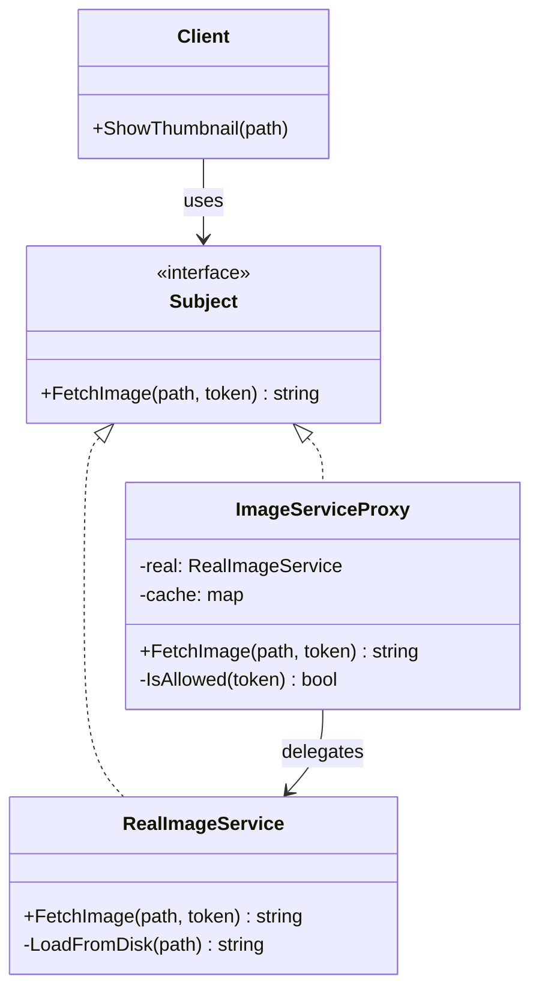

Hello! This is Pan-kun.  

This time, we will cover the **Proxy** pattern from the GoF (Gang of Four) design patterns.  
I’ll explain it practically with a C++ sample, when to use it, and what to watch out for.  

## Introduction

The Proxy pattern is a structural design pattern that **controls access to a real object (`RealSubject`) through a surrogate object (`Proxy`)**.  
Clients don’t need to access the real object directly; they use the proxy through the same interface.

As a primary source, Wikipedia describes it as follows:

> "The proxy pattern is a software design pattern ... a wrapper or agent object that is being called by the client to access the real serving object behind the scenes."  
> (Source: [https://en.wikipedia.org/wiki/Proxy_pattern](https://en.wikipedia.org/wiki/Proxy_pattern))

Refactoring.Guru states its intent like this:

> "Proxy is a structural design pattern that lets you provide a substitute or placeholder for another object. A proxy controls access to the original object..."  
> (Source: [https://refactoring.guru/design-patterns/proxy](https://refactoring.guru/design-patterns/proxy))

[!CARD](https://en.wikipedia.org/wiki/Proxy_pattern)

[!CARD](https://refactoring.guru/design-patterns/proxy)

## Use Cases

Typical use cases:

- **Virtual Proxy (lazy initialization)**  
  Avoid creating heavyweight objects until they are actually needed.
- **Protection Proxy (access control)**  
  Forward requests only when the client satisfies authorization rules.
- **Remote Proxy**  
  Hide network-level details for remote service calls.
- **Caching / Logging Proxy**  
  Handle cross-cutting concerns such as caching, logging, and metrics outside the real service.

## Structure

Core roles in the Proxy pattern:

1. **Subject**  
   Common interface used by clients.
2. **RealSubject**  
   The actual implementation with business logic.
3. **Proxy**  
   Implements `Subject`, adds pre/post processing (control, monitoring, caching, etc.), and delegates to `RealSubject`.
4. **Client**  
   Depends only on `Subject` and remains unaware of whether it talks to real object or proxy.



## C++ Implementation Example

Let’s use an **image loading service** example.  
`ImageServiceProxy` handles **authorization checks** and **caching**, and delegates to `RealImageService` when needed.

```cpp
#include <iostream>
#include <memory>
#include <string>
#include <unordered_map>

// Subject
class IImageService {
public:
    virtual ~IImageService() = default;
    virtual std::string FetchImage(const std::string& path, const std::string& token) = 0;
};

// RealSubject
class RealImageService : public IImageService {
public:
    std::string FetchImage(const std::string& path, const std::string& token) override {
        (void)token; // in production this may be used for audit
        return LoadFromDisk(path);
    }

private:
    std::string LoadFromDisk(const std::string& path) {
        std::cout << "[Real] loading from disk: " << path << "\n";
        return "IMAGE_BYTES(" + path + ")";
    }
};

// Proxy
class ImageServiceProxy : public IImageService {
public:
    std::string FetchImage(const std::string& path, const std::string& token) override {
        if (!IsAllowed(token)) {
            std::cout << "[Proxy] access denied\n";
            return "";
        }

        auto it = cache_.find(path);
        if (it != cache_.end()) {
            std::cout << "[Proxy] cache hit: " << path << "\n";
            return it->second;
        }

        EnsureReal();
        auto bytes = real_->FetchImage(path, token);
        cache_[path] = bytes;
        std::cout << "[Proxy] cache store: " << path << "\n";
        return bytes;
    }

private:
    bool IsAllowed(const std::string& token) const {
        return token == "valid-token";
    }

    void EnsureReal() {
        if (!real_) {
            std::cout << "[Proxy] lazy initialize RealImageService\n";
            real_ = std::make_unique<RealImageService>();
        }
    }

private:
    std::unique_ptr<RealImageService> real_;
    std::unordered_map<std::string, std::string> cache_;
};

int main() {
    std::unique_ptr<IImageService> service = std::make_unique<ImageServiceProxy>();

    // authorization failure
    auto denied = service->FetchImage("/img/banner.png", "invalid");
    std::cout << "denied size=" << denied.size() << "\n\n";

    // first call: lazy init + real load + cache store
    auto first = service->FetchImage("/img/banner.png", "valid-token");
    std::cout << "first size=" << first.size() << "\n\n";

    // second call: cache hit (no real load)
    auto second = service->FetchImage("/img/banner.png", "valid-token");
    std::cout << "second size=" << second.size() << "\n";

    return 0;
}

// Example output
// [Proxy] access denied
// denied size=0
//
// [Proxy] lazy initialize RealImageService
// [Real] loading from disk: /img/banner.png
// [Proxy] cache store: /img/banner.png
// first size=28
//
// [Proxy] cache hit: /img/banner.png
// second size=28
```

In this design, the client depends only on `IImageService`, so swapping implementation (real/proxy) remains transparent.

## Pros / Cons

### Pros

- **Transparent access control**  
  You can add authorization and auditing without changing clients.
- **Lifecycle management**  
  Lazy initialization and resource management can be centralized in proxy.
- **Separation of cross-cutting concerns**  
  Caching, logging, and metrics stay out of core service logic.

### Cons

- **More classes**  
  It may become over-engineering for small applications.
- **Potential latency overhead**  
  Extra proxy logic can increase response time.
- **Risk of responsibility bloat**  
  A single proxy can become hard to maintain if too many concerns are added.

## Difference from Similar Patterns

- **Adapter**: converts interfaces (goal: compatibility).  
- **Decorator**: adds behavior dynamically on the same interface (goal: extension).  
- **Facade**: simplifies access to a subsystem (goal: simplification).  
- **Proxy**: provides controlled/managed access with the same interface (goal: control).

## Practical Notes

- Keep real object and proxy on the **same interface** to preserve substitutability.
- Design cache **TTL and invalidation strategy** first; stale cache can break correctness.
- For remote proxies, explicitly handle **timeouts, retries, and circuit breakers**.
- For protection proxies, always keep failure logs and audit trails.

## Summary

The Proxy pattern is a practical structural pattern that **controls access to real objects via interchangeable surrogate objects implementing the same interface**.  
It is very effective for lazy initialization, access control, caching, and observability without modifying client code.

On the other hand, avoid putting too many responsibilities into one proxy.  
Splitting proxies by concern keeps maintenance manageable.  
In design reviews, first define exactly **what is being controlled** and **where responsibility ends**.

References:

[!CARD](https://en.wikipedia.org/wiki/Proxy_pattern)

[!CARD](https://refactoring.guru/design-patterns/proxy)

That’s it for this article. I’ll cover another GoF pattern next time.  
The implementation shown here is simplified for learning purposes.  
Please evaluate thoroughly before adopting it in production.

Thanks for reading — Pan-kun!
