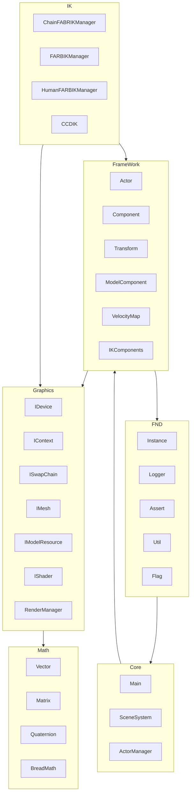

こんにちは！パン君です。



```mermaid
classDiagram
%% 主要クラスと関係（拡張版）
class Instance<T> {
  <<template>>
  + static T instance
}
class SharedInstance<T> {
  <<template>>
  + static shared_ptr<T> instance
  + static T* makeInstancePtr(...)
}
class MapInstance<T> {
  <<template>>
  + static map<string, T> instance
  + static T& MakeInstance(string, ...)
}

class Logger {
  + static void SetWriter(ILogWriter*)
  + static void SetLevel(LogLevel)
  + static void Print(u32 type, LogLevel level, ...)
}

class Actor {
  - vector<shared_ptr<Component>> components
  - vector<shared_ptr<Actor>> children
  + static shared_ptr<Actor> Create()
  + AddComponent<T>(...)
  + GetComponent<T>()
  + GetAllComponent()
  + AddChildActor<T>(...)
}

class Component {
  - weak_ptr<Actor> owner
  - string ID
  + Initialize()
  + PreUpdate()
  + Update()
  + NextUpdate()
  + Draw()
  + GUI()
}

class Transform {
  - Vector3 translate
  - Quaternion rotate
  - Vector3 scale
  + SetTranslate(Vector3)
  + SetRotate(Quaternion)
  + SetScale(Vector3)
  + const Matrix& GetLocalTransform()
  + const Matrix& GetWorldTransform()
  + GUI()
}

class ActorManager {
  - vector<shared_ptr<Actor>> actors
  + Initialize()
  + Update()
  + Draw()
  + AddActors(shared_ptr<Actor>)
  + RemoveActor(shared_ptr<Actor>)
  + GetActorFromID(string)
}

class IDevice {
  <<interface>>
  + static unique_ptr<IDevice> Create()
  + Initialize()
  + Finalize()
}

class IContext {
  <<interface>>
  + static unique_ptr<IContext> Create()
  + Initialize(IDevice*)
  + Draw(...)
  + Begin()
  + End()
}

class IMesh {
  <<interface>>
  + static unique_ptr<IMesh> Create()
  + Initialize(IDevice*, MeshDesc)
  + Draw(IDevice*, ...)
  + ComputeBounds()
}

class RenderManager {
  - map<string, shared_ptr<IShader>> shaders
  + Initialize()
  + Render()
  + RegisterModelRenderShader(string, IShader)
}

class Model {
  - vector<Node> nodes
  - vector<MeshNode> meshNodes
  + Load(IGraphicsDevice*, const char* filename)
  + Update()
}

class FARBIKManager {
  - vector<shared_ptr<IKSetUp>> registedIK
  + RegisterFABRIK(vector<IJoint>*, shared_ptr<Transform>, Vector3* target)
  + UnRegisterFABRIK(...)
  + Update()
  + GUI()
}

class CCDIK {
  + FootCCDIK(...)
  + Update()
  + GUI()
}

%% 継承 / 関連
Component <|-- Transform
Component <|-- Model
Component <|-- VelocityMap
Actor "1" o-- "many" Component
Actor "1" o-- "many" Actor : children
ActorManager "1" o-- "many" Actor
Transform --> Matrix
Model --> IMesh
RenderManager --> IShader
FARBIKManager ..> CCDIK : may use
SphereModelComponent ..> FARBIKManager : registers
```

```mermaid
sequenceDiagram
%% シーケンス：フレーム内の IK 実行フロー（代表）
participant Main
participant SceneSystem
participant SceneGame
participant ActorManager
participant Actor
participant SphereModelComponent
participant FARBIKManager
participant IMesh

Main->>SceneSystem: Update()
SceneSystem->>SceneGame: Update()
SceneGame->>ActorManager: Update()
ActorManager->>Actor: Update()
Actor->>SphereModelComponent: NextUpdate()
SphereModelComponent->>FARBIKManager: RegisterFABRIK/Update()
FARBIKManager->>FARBIKManager: FABRIK (Forward/Backward solve)
FARBIKManager->>SphereModelComponent: Apply transforms
SphereModelComponent->>IMesh: ComputeSkinnedVertices/Update
IMesh-->>SphereModelComponent: updated mesh data
SphereModelComponent-->>Actor: done
Actor-->>ActorManager: done
ActorManager-->>SceneGame: done
SceneGame-->>SceneSystem: done
SceneSystem-->>Main: done
```
