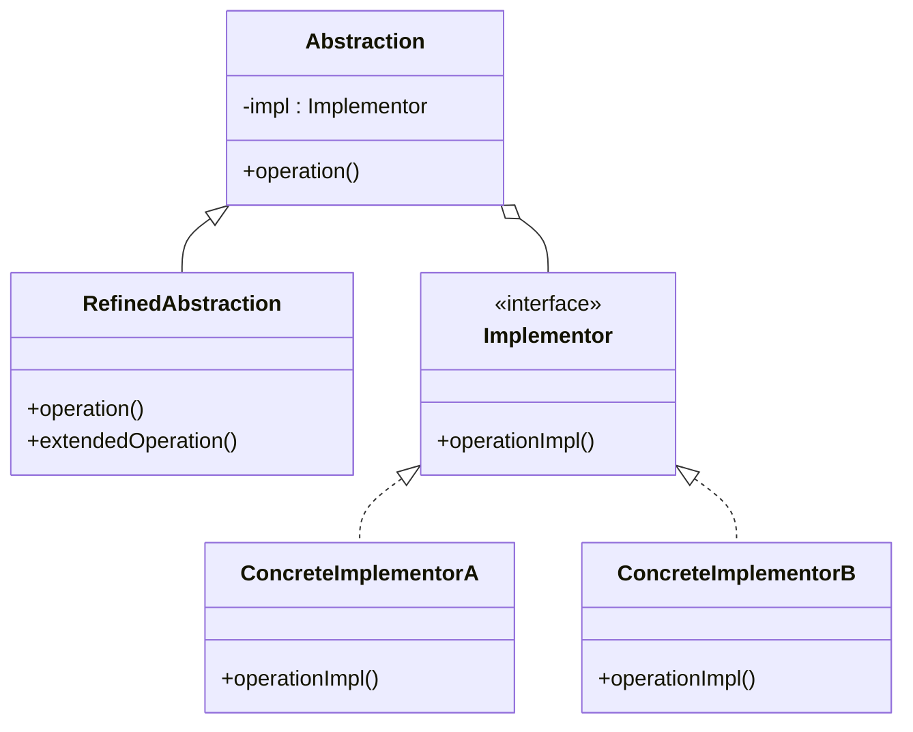

こんにちは！パン君です。  

今回は GoF（Gang of Four）のデザインパターンのブリッジ編になります。  
サンプルコード（C++）、作り方、使うタイミング、注意点などを含めて実用的に解説します。   

## はじめに

ブリッジパターンとは **抽象化**と**実装**を分離し、それらを独立して変更できるようにすることです。  
普段クラス継承を行うと**実装**と**抽象化**が密結合しますが、このデザインパターンではそれらを解決する柔軟な拡張性を実現します。　　

> Bridge パターン（ブリッジ・パターン）とは、GoF（Gang of Four; 4人のギャングたち）によって定義された。ソフトウェア開発に使われるデザインパターンの1つである。  
> 抽象化と実装を切り離すことで、それぞれを独立して変更することができる。
>
> 出典: [Bridge パターン - Wikipedia](https://ja.wikipedia.org/wiki/Bridge_%E3%83%91%E3%82%BF%E3%83%BC%E3%83%B3)

[!CARD](https://ja.wikipedia.org/wiki/Bridge_%E3%83%91%E3%82%BF%E3%83%BC%E3%83%B3)  

## ユースケース

採用を検討する状況の例としていくつかあげます。  

- **抽象と実装を恒久的に結合したくない場合**  
  実行時に実装を切り替えたり選択したりする必要がある場合に便利です。
- **抽象クラスと実装クラスの両方を拡張する必要がある場合**  
  クラスの爆増を防ぐので独立したレイヤーで拡張を管理可能です。
- **実装の変更が他に影響を与えないようにしたい場合**  
  実装の詳細を隠蔽し、再コンパイルの範囲を最小限に抑えることができます。（C++ではPimplイディオムとして知られています）
- **多数のクラスが類似した実装を共有しているが、少しずつ異なる場合**  
  機能の階層と実装の階層を分けることでコードの重複を減らせます。

## 構造

Bridgeパターンを実装するには、以下の4つの役割を持つクラスが必要です。

1.  **Abstraction（抽象化）**
    *   機能の階層の最上位にあるクラスです。
    *   `Implementor` 型のインスタンスを保持し、機能の処理をその実装クラスに委譲します。
2.  **RefinedAbstraction（改善された抽象化）**
    *   `Abstraction` を継承して機能を追加・拡張したクラスです。
    *   具体的な機能の組み合わせを定義します。
3.  **Implementor（実装者）**
    *   実装の階層の最上位にあるインターフェース（または抽象クラス）です。
    *   `Abstraction` が利用する基本的なAPIを定義します。
4.  **ConcreteImplementor（具体的な実装者）**
    *   `Implementor` インターフェースを具体的に実装するクラスです。
    *   プラットフォーム固有の処理や、ライブラリ依存の処理などはここに記述されます。

下記はこれらをUMLで表しました。  
**機能のクラス階層**と**実装のクラス階層**と分かれていて、それを文字通り橋渡し(ブリッジ)されているのが特徴です。  



## C++ 実装例

ここでは図形描画を例に挙げます。  
**形状**という抽象的な概念と**描画API**という具体的な実装を分離します。  

これにより**形状クラス**側で新しい形状(長方形や円)を追加したり**描画API**側で新しい描画方法（OpenGLやDirectXなど）を追加したりしてもお互いに影響を与えずに拡張できます。  

```cpp
// 描画APIのインターフェース
class DrawingAPI {
public:
    virtual ~DrawingAPI() = default;
    virtual void drawCircle(double x, double y, double radius) = 0;
};

// 具体的な描画API 1
class DrawingAPI1 : public DrawingAPI {
public:
    void drawCircle(double x, double y, double radius) override {
        std::cout << "API1.circle at " << x << ":" << y << " radius " << radius << std::endl;
    }
};

// 具体的な描画API 2
class DrawingAPI2 : public DrawingAPI {
public:
    void drawCircle(double x, double y, double radius) override {
        std::cout << "API2.circle at " << x << ":" << y << " radius " << radius << std::endl;
    }
};

// 形状の抽象クラス
class Shape {
protected:
    DrawingAPI* drawingAPI; // Implementorへの参照を保持

public:
    Shape(DrawingAPI* api) : drawingAPI(api) {}
    virtual ~Shape() = default;

    virtual void draw() = 0; // 高レベルな操作
    virtual void resizeByPercentage(double pct) = 0; // 高レベルな操作
};

// 具体的な形状：円
class CircleShape : public Shape {
private:
    double x, y, radius;

public:
    CircleShape(double x, double y, double radius, DrawingAPI* api)
        : Shape(api), x(x), y(y), radius(radius) {}

    void draw() override {
        // 実装の詳細（どう描画するか）は drawingAPI に委譲する
        drawingAPI->drawCircle(x, y, radius);
    }

    void resizeByPercentage(double pct) override {
        radius *= (1.0 + pct / 100.0);
    }
};

int main() {
    DrawingAPI1 api1;
    DrawingAPI2 api2;

    // 同じ「円」という概念だが描画APIを切り替えてインスタンス化できる
    CircleShape circle1(1, 2, 3, &api1);
    CircleShape circle2(5, 7, 11, &api2);

    circle1.resizeByPercentage(10);
    circle2.resizeByPercentage(10);

    std::cout << "--- Circle 1 with API 1 ---" << std::endl;
    circle1.draw();

    std::cout << "--- Circle 2 with API 2 ---" << std::endl;
    circle2.draw();

    return 0;
}

// 実行結果
// --- Circle 1 with API 1 ---
// API1.circle at 1:2 radius 3.3
// --- Circle 2 with API 2 ---
// API2.circle at 5:7 radius 12.1
```

この例では`Shape`クラスが`DrawingAPI`のポインタを持っています。  
`CircleShape`の`draw`メソッドが呼ばれると実際の描画処理は`DrawingAPI`の実装クラスに委譲されます。  

## メリット / デメリット

### メリット

*   **実装の隠蔽と依存関係の削減**
    *   クライアントコードは抽象化クラス（`Abstraction`）のみを知っていればよいため、実装の詳細に依存しません。これにより、コンパイル時間の短縮や疎結合な設計が可能になります。
*   **拡張性の向上**
    *   機能のクラス階層と実装のクラス階層を独立して拡張できます。新しい機能を追加しても実装クラスに影響を与えず、逆に新しい実装を追加しても機能クラスに影響を与えません。
*   **実行時の実装切り替え**
    *   実行時に `Implementor` オブジェクトを差し替えることで、動的に振る舞いを変更することができます。

### デメリット

*   **設計の複雑化**
    *   単純な継承関係で済むような小規模なシステムにおいては、クラス数が増え、構造が不必要に複雑になる可能性があります。
*   **コードの可読性の低下**
    *   処理が抽象化クラスから実装クラスへと委譲されるため、全体像を把握するために複数のクラスを行き来する必要があり、コードの直感的な理解が難しくなる場合があります。

## まとめ

ブリッジパターンは**機能の拡張**と**実装の拡張**の異なる変更要件を切り離すことでシステムを柔軟に保つ強力な手法です。  
将来的な変更要件が不透明な大規模開発において真価を発揮します。  
ただしユースケースによっては過剰設計になるため、実際にクラス爆発しそうなったときにリファクタリングの一環として導入するというのも一つの手段です。  

参考・出典を記します  

[!CARD](https://ja.wikipedia.org/wiki/Bridge_%E3%83%91%E3%82%BF%E3%83%BC%E3%83%B3)  

それでは、次回は別の GoF パターンについても解説していきます。  
この記事で紹介した実装は学習目的に簡素化しています。  
実プロダクションで採用する際は要件に合わせて十分に検討してください。  

以上、パン君でした！
