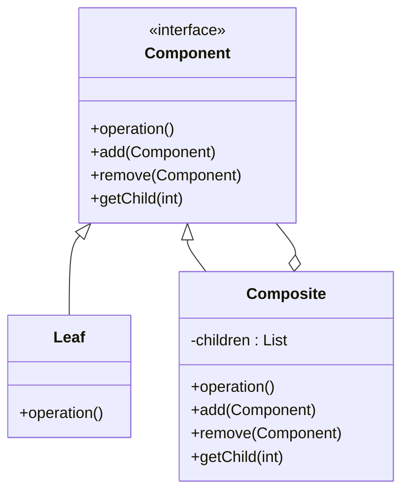

Hello! I'm Pan-kun.

In this article, we will discuss the Composite Pattern from the GoF (Gang of Four) design patterns.
I will provide a practical explanation, including sample code in C++, when to use it, how to implement it, and important caveats.

## Introduction

The Composite Pattern is a structural design pattern that allows you to **treat individual objects and compositions of objects uniformly**.
When dealing with recursive structures, such as a file system (folders and files), it enables clients to manipulate individual elements and composed elements without distinguishing between them.

> The Composite pattern is a design pattern used in software engineering, defined by the GoF (Gang of Four).
> It describes a group of objects that are treated the same way as a single instance of the same type of object, particularly for elements of a tree structure.
>
> Source: [Composite pattern - Wikipedia](https://en.wikipedia.org/wiki/Composite_pattern)

[!CARD](https://en.wikipedia.org/wiki/Composite_pattern)

## Use Cases

Here are a few examples of situations where you should consider adopting this pattern:

- **When you need to handle tree-structured data**
  It is well-suited for representing data with hierarchical structures, such as file systems, GUI widgets, or organizational charts.
- **When client code needs to treat "parts" and "wholes" uniformly**
  This is useful when you want to execute operations on a single object and operations on a collection of objects using the exact same interface.
- **When you want to write recursive processing concisely**
  It makes it easier to implement processes that uniformly propagate operations recursively across complex tree structures.

## Structure

To implement the Composite pattern, you need classes that fulfill the following three roles:

1.  **Component**
    *   Defines the common interface for all elements (both Leaves and Composites).
    *   The client manipulates the elements through this interface.
2.  **Leaf**
    *   An element at the end of the tree that has no child elements.
    *   Implements the actual behavior of the Component interface.
3.  **Composite**
    *   An element that contains child elements (Leaves or other Composites).
    *   It has methods for managing child elements (such as adding and removing) and delegates Component interface operations to its children.

The following UML diagram illustrates these relationships.
Because both **Leaf** and **Composite** implement the same **Component** interface, a recursive structure is formed.



## C++ Implementation Example

Let us use a file system (directories and files) as an example.
We will treat **files** (Leaf) and **directories** (Composite) uniformly to perform operations such as calculating sizes.

This allows us to recursively calculate the size, regardless of whether a directory contains files or even further nested directories.

```cpp
#include <iostream>
#include <vector>
#include <string>
#include <algorithm>
#include <memory>

// Component: Common interface for files and directories
class FileSystemUnit {
protected:
    std::string name;

public:
    FileSystemUnit(const std::string& name) : name(name) {}
    virtual ~FileSystemUnit() = default;

    // Common operations
    virtual int getSize() const = 0;
    virtual void printList(const std::string& prefix = "") const = 0;

    // Child element management (does nothing or throws an error by default)
    virtual void add(std::shared_ptr<FileSystemUnit> unit) {
        // Not supported by Leaf, so the default implementation can be empty or throw an exception
    }
};

// Leaf: Individual file
class File : public FileSystemUnit {
private:
    int size;

public:
    File(const std::string& name, int size) : FileSystemUnit(name), size(size) {}

    int getSize() const override {
        return size;
    }

    void printList(const std::string& prefix = "") const override {
        std::cout << prefix << "/" << name << " (" << size << "KB)" << std::endl;
    }
};

// Composite: Directory
class Directory : public FileSystemUnit {
private:
    std::vector<std::shared_ptr<FileSystemUnit>> children;

public:
    Directory(const std::string& name) : FileSystemUnit(name) {}

    int getSize() const override {
        int totalSize = 0;
        for (const auto& child : children) {
            totalSize += child->getSize();
        }
        return totalSize;
    }

    void printList(const std::string& prefix = "") const override {
        std::cout << prefix << "/" << name << " (Total: " << getSize() << "KB)" << std::endl;
        for (const auto& child : children) {
            child->printList(prefix + "/" + name);
        }
    }

    void add(std::shared_ptr<FileSystemUnit> unit) override {
        children.push_back(unit);
    }
};

int main() {
    // Create directory structure
    auto root = std::make_shared<Directory>("root");
    auto bin = std::make_shared<Directory>("bin");
    auto tmp = std::make_shared<Directory>("tmp");
    auto usr = std::make_shared<Directory>("usr");

    auto vi = std::make_shared<File>("vi", 100);
    auto latex = std::make_shared<File>("latex", 200);

    root->add(bin);
    root->add(tmp);
    root->add(usr);

    bin->add(vi);
    bin->add(latex);
    
    // Deeper hierarchy
    auto local = std::make_shared<Directory>("local");
    usr->add(local);
    local->add(std::make_shared<File>("myscript.sh", 10));

    // Display the entire structure and calculate the size
    // The client can manipulate 'root' without worrying whether it is a Composite or a Leaf
    std::cout << "--- File System List ---" << std::endl;
    root->printList();
    
    return 0;
}

// Execution result
// --- File System List ---
// /root (Total: 310KB)
// /root/bin (Total: 300KB)
// /root/bin/vi (100KB)
// /root/bin/latex (200KB)
// /root/tmp (Total: 0KB)
// /root/usr (Total: 10KB)
// /root/usr/local (Total: 10KB)
// /root/usr/local/myscript.sh (10KB)
```

In this example, `FileSystemUnit` acts as the Component, while `File` and `Directory` act as the Leaf and Composite, respectively.
`Directory::getSize()` calls the `getSize()` method of its child elements, and this process occurs recursively to calculate the total size.

## Advantages and Disadvantages

### Advantages

- **Simplification of Client Code**
  The client does not need to distinguish between individual objects and composite objects. You can reduce conditional branching (such as if-else or switch statements) and write code that leverages polymorphism.
- **Ease of Adding New Element Types**
  Even if you add new Leaf or Composite classes, there is almost no need to modify existing code (adhering to the Open/Closed Principle).
- **Expressiveness for Recursive Structures**
  Complex tree structures can be represented intuitively, and operations on the entire structure can be implemented effortlessly.

### Disadvantages

- **Overgeneralization of Design**
  The Component interface may include methods (such as `add` or `remove`) that are meaningless for a Leaf. This can potentially compromise some degree of type safety (requiring careful consideration of the Liskov Substitution Principle).
- **Difficulty in Enforcing Constraints**
  If you want to restrict a Composite to only hold certain types of child elements, static type checking alone is often insufficient, and runtime checks may become necessary.

## Conclusion

The Composite pattern is an extremely powerful design pattern when dealing with **recursive tree structures**.
By treating "parts" and "wholes" uniformly, you can consistently perform operations on complex structures while keeping the client code simple.

However, how to handle child management methods for a Leaf (e.g., whether to throw an exception or do nothing) is a design trade-off, so it is necessary to make appropriate decisions based on your specific requirements.

References and sources are listed below:

[!CARD](https://refactoring.guru/design-patterns/composite)

I will explain another GoF pattern in the next article.
Please note that the implementation introduced in this article has been simplified for educational purposes.
When adopting it in a production environment, please thoroughly consider your requirements.

That is all from Pan-kun!
