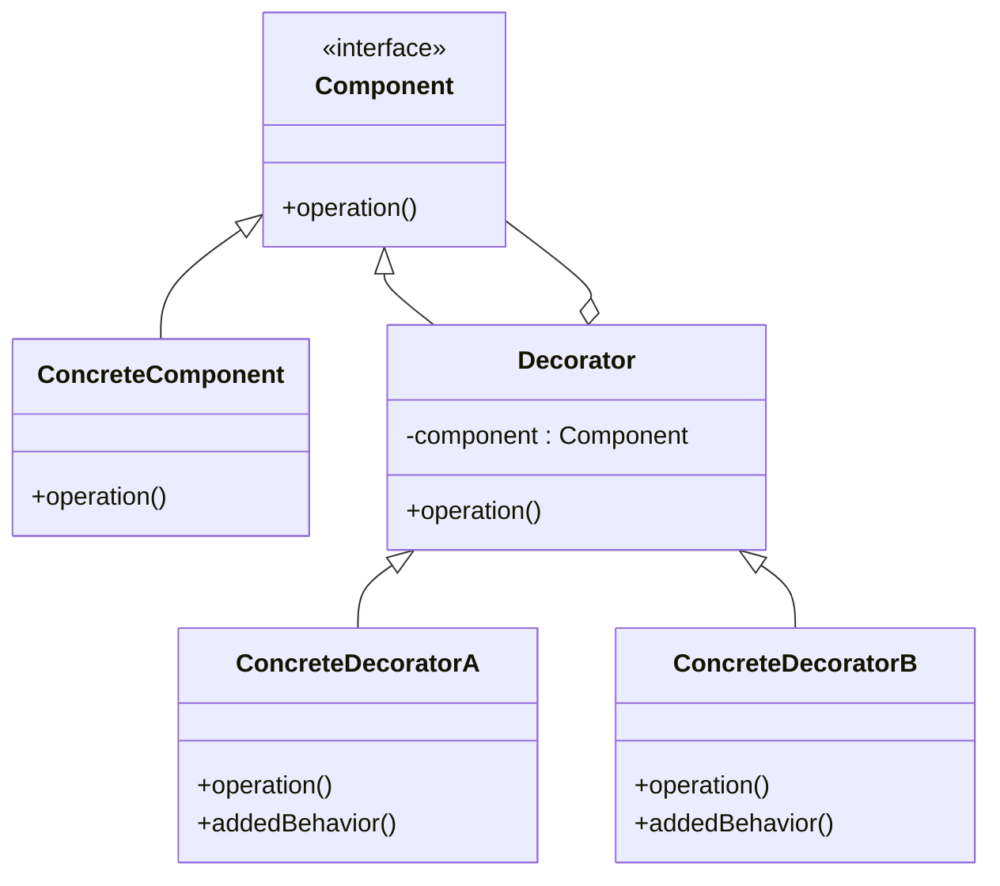

Hello! This is Pan-kun.  

This time, we will be covering the Decorator pattern from the GoF (Gang of Four) design patterns.  
I will explain it practically, including a sample code in C++, how to build it, when to use it, and some caveats to keep in mind.

## Introduction

The Decorator pattern is a structural design pattern that lets you **attach new behaviors to objects by placing these objects inside special wrapper objects that contain the behaviors**.  
It provides a flexible alternative to subclassing (inheritance) for extending functionality.

> In object-oriented programming, the decorator pattern is a design pattern that allows behavior to be added to an individual object, dynamically, without affecting the behavior of other objects from the same class.
>
> Source: [Decorator pattern - Wikipedia](https://en.wikipedia.org/wiki/Decorator_pattern)

[!CARD](https://en.wikipedia.org/wiki/Decorator_pattern)  

## Use Cases

Here are some situations where you might consider adopting this pattern:

- **When you need to add or remove features dynamically**  
  It is suitable when you want to add responsibilities (features) to an object dynamically and transparently at runtime.
- **When you want to prevent a subclass explosion**  
  If you try to implement all combinations of features using inheritance, the number of classes will increase exponentially. With decorators, you can handle this flexibly by combining multiple small decorators.
- **When you want to extend behavior without modifying class definitions**  
  It is useful when you want to extend the behavior of existing code (especially classes in libraries that you cannot modify).

## Structure

To implement the Decorator pattern, you need classes with the following roles:

1.  **Component**
    *   Defines the common interface for objects that can have responsibilities added to them dynamically.
2.  **ConcreteComponent**
    *   The base class that implements the `Component` interface. Features will be added to this object.
3.  **Decorator**
    *   Implements the `Component` interface and maintains a reference to a `Component` object inside.
    *   Delegates operations to the referenced `Component`.
4.  **ConcreteDecorator**
    *   A subclass of `Decorator` that adds the actual new functionalities or state.

Below is the UML representation of these roles.  



## C++ Implementation Example

Here, we will use a cafe beverage ordering system as an example.  
We will dynamically add **Mocha** and **Whip Cream** (ConcreteDecorators) to a base **Espresso** (ConcreteComponent) to update the description and price.

```cpp
#include <iostream>
#include <string>
#include <memory>

// Component: Common interface for beverages
class Beverage {
public:
    virtual ~Beverage() = default;
    virtual std::string getDescription() const = 0;
    virtual double cost() const = 0;
};

// ConcreteComponent: Base beverage (Espresso)
class Espresso : public Beverage {
public:
    std::string getDescription() const override {
        return "Espresso";
    }
    double cost() const override {
        return 1.99;
    }
};

// Decorator: Base decorator class
class CondimentDecorator : public Beverage {
protected:
    std::shared_ptr<Beverage> beverage; // Holds the wrapped Component
public:
    CondimentDecorator(std::shared_ptr<Beverage> beverage) : beverage(beverage) {}
    
    std::string getDescription() const override {
        return beverage->getDescription();
    }
    double cost() const override {
        return beverage->cost();
    }
};

// ConcreteDecorator: Specific topping (Mocha)
class Mocha : public CondimentDecorator {
public:
    Mocha(std::shared_ptr<Beverage> beverage) : CondimentDecorator(beverage) {}
    
    std::string getDescription() const override {
        return beverage->getDescription() + ", Mocha";
    }
    double cost() const override {
        return beverage->cost() + 0.20;
    }
};

// ConcreteDecorator: Specific topping (Whip)
class Whip : public CondimentDecorator {
public:
    Whip(std::shared_ptr<Beverage> beverage) : CondimentDecorator(beverage) {}
    
    std::string getDescription() const override {
        return beverage->getDescription() + ", Whip";
    }
    double cost() const override {
        return beverage->cost() + 0.10;
    }
};

int main() {
    // 1. Order a base Espresso
    std::shared_ptr<Beverage> myDrink = std::make_shared<Espresso>();
    std::cout << myDrink->getDescription() << " $" << myDrink->cost() << std::endl;

    // 2. Add Mocha (wraps the Espresso)
    myDrink = std::make_shared<Mocha>(myDrink);
    std::cout << myDrink->getDescription() << " $" << myDrink->cost() << std::endl;

    // 3. Add Whip (wraps the Mocha-wrapped Espresso)
    myDrink = std::make_shared<Whip>(myDrink);
    std::cout << myDrink->getDescription() << " $" << myDrink->cost() << std::endl;

    return 0;
}

// Execution Result
// Espresso $1.99
// Espresso, Mocha $2.19
// Espresso, Mocha, Whip $2.29
```

In this example, the decorators implementing the `Beverage` interface wrap another `Beverage` object. This allows us to stack multiple toppings without altering the existing classes.

## Pros / Cons

### Pros

- **More flexible than subclassing**
  You can add or remove responsibilities from an object at runtime without using inheritance.
- **Prevents class explosion**
  Even if you need various combinations of features, you can keep the number of classes low (just combine multiple decorators).
- **Adheres to the Single Responsibility Principle (SRP)**
  Instead of having a monolithic class with all features, each decorator can focus on a single responsibility.

### Cons

- **Results in many small objects**
  It can introduce numerous tiny decorator classes, making the overall system harder to grasp.
- **Design can become dependent on decorator order**
  If the order of decoration affects the outcome, it can become a source of bugs.
- **Hard to write code dependent on specific object types**
  Once wrapped in a decorator, the type is hidden, making it difficult to directly access methods specific to the `ConcreteComponent`.

## Summary

The Decorator pattern is a powerful pattern for flexibly extending object functionalities using **delegation (composition) instead of inheritance**.  
It is widely adopted in GUI toolkits (like adding scrollbars to windows) and I/O streams (like Java's `java.io`).

However, overusing it can result in a cluster of small objects that hinder system comprehension, so consider adopting it only when dynamic extension is truly necessary.

References and sources are listed below.

[!CARD](https://refactoring.guru/design-patterns/decorator)  

Well then, I will cover another GoF pattern in the next post.  
The implementation introduced in this article has been simplified for learning purposes.  
Please consider the requirements carefully when adopting it in a production environment.

That's all from Pan-kun!
