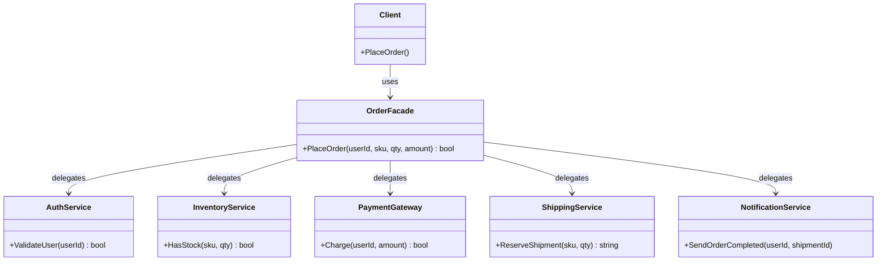

Hello! This is Pan-kun.  

This time, we will cover the **Facade** pattern from the GoF (Gang of Four) design patterns.  
I’ll explain it practically with a C++ sample, when to use it, and what to watch out for.  

## Introduction

The Facade pattern is a structural design pattern that **provides a simple entry point to a complex subsystem**.  
Instead of dealing with many classes and call orders directly, the client can call just one facade interface.

As primary sources:

> "The facade pattern ... is an object that serves as a front-facing interface masking more complex underlying or structural code."  
> (Source: [https://en.wikipedia.org/wiki/Facade_pattern](https://en.wikipedia.org/wiki/Facade_pattern))

And Refactoring.Guru defines its intent as:

> "Facade is a structural design pattern that provides a simplified interface to a library, a framework, or any other complex set of classes."  
> (Source: [https://refactoring.guru/design-patterns/facade](https://refactoring.guru/design-patterns/facade))

[!CARD](https://en.wikipedia.org/wiki/Facade_pattern)

[!CARD](https://refactoring.guru/design-patterns/facade)

## Use Cases

Typical situations where Facade is useful:

- **When external SDKs/libraries are complex**  
  You can hide initialization, validation, execution order, and cleanup behind one method.
- **When you want to reduce layer coupling**  
  UI/application layers depend on a stable facade instead of many subsystem details.
- **When you want incremental refactoring of legacy code**  
  First route calls through a facade, then improve internal subsystems safely with limited impact.

## Structure

The basic roles are straightforward:

1. **Client**  
   Uses the facade interface only.
2. **Facade**  
   Coordinates multiple subsystem APIs and exposes simpler operations.
3. **Subsystem Classes**  
   Perform actual work. They usually don’t know the facade exists.



## C++ Implementation Example

Let’s use an **order placement** use case.  
The client calls `OrderFacade::PlaceOrder` once, and authentication, inventory check, payment, shipment reservation, and notification are all handled.

```cpp
#include <iostream>
#include <string>

class AuthService {
public:
    bool ValidateUser(const std::string& userId) const {
        return !userId.empty();
    }
};

class InventoryService {
public:
    bool HasStock(const std::string& sku, int qty) const {
        return !sku.empty() && qty > 0; // simplified for learning
    }
};

class PaymentGateway {
public:
    bool Charge(const std::string& userId, int amount) const {
        return !userId.empty() && amount > 0;
    }
};

class ShippingService {
public:
    std::string ReserveShipment(const std::string& sku, int qty) const {
        if (sku.empty() || qty <= 0) return "";
        return "SHIP-20260529-001";
    }
};

class NotificationService {
public:
    void SendOrderCompleted(const std::string& userId, const std::string& shipmentId) const {
        std::cout << "Notify user=" << userId << " shipment=" << shipmentId << "\n";
    }
};

class OrderFacade {
public:
    bool PlaceOrder(const std::string& userId,
                    const std::string& sku,
                    int qty,
                    int amount) {
        if (!auth_.ValidateUser(userId)) {
            std::cout << "auth failed\n";
            return false;
        }
        if (!inventory_.HasStock(sku, qty)) {
            std::cout << "out of stock\n";
            return false;
        }
        if (!payment_.Charge(userId, amount)) {
            std::cout << "payment failed\n";
            return false;
        }

        const std::string shipmentId = shipping_.ReserveShipment(sku, qty);
        if (shipmentId.empty()) {
            std::cout << "shipping failed\n";
            return false;
        }

        notifier_.SendOrderCompleted(userId, shipmentId);
        return true;
    }

private:
    AuthService auth_;
    InventoryService inventory_;
    PaymentGateway payment_;
    ShippingService shipping_;
    NotificationService notifier_;
};

int main() {
    OrderFacade facade;

    const bool ok = facade.PlaceOrder(
        "user-001",   // userId
        "sku-coffee", // sku
        2,             // qty
        1800           // amount
    );

    std::cout << (ok ? "order success" : "order failed") << "\n";
    return 0;
}

// Example output
// Notify user=user-001 shipment=SHIP-20260529-001
// order success
```

The key point: the client doesn’t touch subsystem classes directly.  
Even if a subsystem changes (for example, replacing a payment SDK), impact can be contained in `OrderFacade`.

## Pros / Cons

### Pros

- **Reduced coupling**  
  The client depends on one facade instead of many subsystem classes.
- **Unified usage flow**  
  Easier to prevent call-order mistakes and forgotten steps.
- **Localized change**  
  Subsystem evolution is often absorbed in the facade layer.

### Cons

- **Facade bloat risk**  
  If everything is pushed into one class, it can become a god object.
- **Hidden complexity**  
  A very simple API may hide too much, making debugging harder in some cases.

## Difference from Similar Patterns

- **Adapter**: Converts one interface into another expected by the client.  
- **Decorator**: Adds responsibilities dynamically while keeping the same interface.  
- **Facade**: Provides a simple unified entry point to a whole subsystem.  

In the GoF structural patterns, these are often discussed together, but their intent is clearly different.

## Practical Notes

- Don’t put too much domain logic into the facade; its core role is an entry point.
- Split facades by use case when needed (e.g., `OrderFacade`, `BillingFacade`).
- Standardize error/exception policy and keep the client contract explicit.
- For legacy systems, first centralize calls through facades, then refactor subsystem internals gradually.

## Summary

The Facade pattern provides a **simple entry to a complex subsystem**, reducing client-side complexity and dependency spread.  
It is especially effective when SDKs are complicated, call sequences are fragile, or system boundaries need to be clarified.

At the same time, avoid over-centralization in one giant facade.  
Keep facade responsibilities focused and split by feature area for long-term maintainability.

References:

[!CARD](https://en.wikipedia.org/wiki/Facade_pattern)

[!CARD](https://refactoring.guru/design-patterns/facade)

That’s it for this article. I’ll cover another GoF pattern next time.  
The implementation shown here is simplified for learning purposes.  
Please evaluate thoroughly before adopting it in production.

Thanks for reading — Pan-kun!
