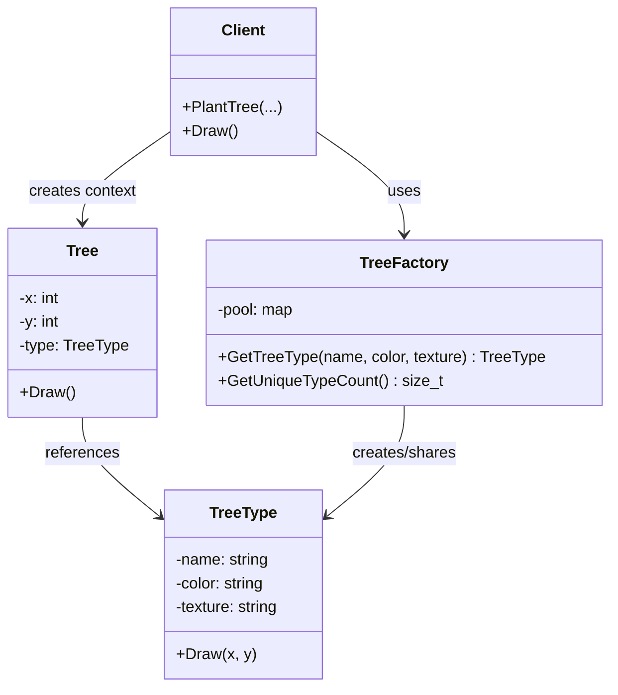

Hello! This is Pan-kun.  

This time, we will cover the **Flyweight** pattern from the GoF (Gang of Four) design patterns.  
I’ll explain it practically with a C++ sample, when to use it, and what to watch out for.  

## Introduction

The Flyweight pattern is a structural design pattern that **reduces memory usage by sharing common state among a huge number of similar objects**.  
The key is splitting state into **intrinsic (shared)** and **extrinsic (context-specific)** parts.  

As primary sources:

> "In computer programming, the flyweight software design pattern refers to an object that minimizes memory usage by sharing some of its data with other similar objects."  
> (Source: [https://en.wikipedia.org/wiki/Flyweight_pattern](https://en.wikipedia.org/wiki/Flyweight_pattern))

And Refactoring.Guru defines its intent as:

> "Flyweight is a structural design pattern that lets you fit more objects into the available amount of RAM by sharing common parts of state between multiple objects instead of keeping all of the data in each object."  
> (Source: [https://refactoring.guru/design-patterns/flyweight](https://refactoring.guru/design-patterns/flyweight))

[!CARD](https://en.wikipedia.org/wiki/Flyweight_pattern)

[!CARD](https://refactoring.guru/design-patterns/flyweight)

## Use Cases

Typical situations where Flyweight is useful:

- **When you create massive numbers of similar objects**  
  Example: bullets, trees, particles in games, map markers, text glyphs.
- **When heavy state is duplicated many times**  
  Example: textures, font data, color settings, metadata.
- **When RAM constraints are strict**  
  Example: mobile devices, embedded systems, large-scale rendering workloads.

## Structure

Main roles in the Flyweight pattern:

1. **Flyweight**  
   Holds shared immutable intrinsic state.
2. **Context**  
   Holds extrinsic state unique per object instance and references a Flyweight.
3. **FlyweightFactory**  
   Reuses flyweights by key; creates and caches one if it doesn’t exist.
4. **Client**  
   Manages contexts and requests flyweights through the factory.



## C++ Implementation Example

Let’s use a **forest rendering** example.  
`TreeType` is the shared Flyweight (intrinsic state), while `Tree` is the Context that stores coordinates (extrinsic state).

```cpp
#include <iostream>
#include <memory>
#include <string>
#include <unordered_map>
#include <vector>

// Flyweight: shared immutable data
class TreeType {
public:
    TreeType(std::string name, std::string color, std::string texture)
        : name_(std::move(name)), color_(std::move(color)), texture_(std::move(texture)) {}

    void Draw(int x, int y) const {
        // Assume an actual render engine call (simplified here)
        std::cout << "Draw " << name_ << " at (" << x << "," << y
                  << ") color=" << color_ << " texture=" << texture_ << "\n";
    }

private:
    std::string name_;
    std::string color_;
    std::string texture_;
};

// FlyweightFactory: create/reuse shared objects
class TreeFactory {
public:
    std::shared_ptr<const TreeType> GetTreeType(const std::string& name,
                                                const std::string& color,
                                                const std::string& texture) {
        const std::string key = name + "|" + color + "|" + texture;
        auto it = pool_.find(key);
        if (it != pool_.end()) {
            return it->second;
        }

        auto type = std::make_shared<TreeType>(name, color, texture);
        pool_.emplace(key, type);
        return type;
    }

    std::size_t GetUniqueTypeCount() const {
        return pool_.size();
    }

private:
    std::unordered_map<std::string, std::shared_ptr<const TreeType>> pool_;
};

// Context: unique state (coordinates) + Flyweight reference
class Tree {
public:
    Tree(int x, int y, std::shared_ptr<const TreeType> type)
        : x_(x), y_(y), type_(std::move(type)) {}

    void Draw() const {
        type_->Draw(x_, y_);
    }

private:
    int x_;
    int y_;
    std::shared_ptr<const TreeType> type_;
};

class Forest {
public:
    void PlantTree(int x, int y,
                   const std::string& name,
                   const std::string& color,
                   const std::string& texture) {
        auto type = factory_.GetTreeType(name, color, texture);
        trees_.emplace_back(x, y, std::move(type));
    }

    void DrawSample(std::size_t limit) const {
        for (std::size_t i = 0; i < trees_.size() && i < limit; ++i) {
            trees_[i].Draw();
        }
    }

    std::size_t TreeCount() const {
        return trees_.size();
    }

    std::size_t UniqueTypeCount() const {
        return factory_.GetUniqueTypeCount();
    }

private:
    TreeFactory factory_;
    std::vector<Tree> trees_;
};

int main() {
    Forest forest;

    // Plant 100,000 trees (only 3 unique types)
    for (int i = 0; i < 100000; ++i) {
        if (i % 3 == 0) {
            forest.PlantTree(i % 1000, i / 1000, "Oak", "Green", "oak.png");
        } else if (i % 3 == 1) {
            forest.PlantTree(i % 1000, i / 1000, "Pine", "DarkGreen", "pine.png");
        } else {
            forest.PlantTree(i % 1000, i / 1000, "Sakura", "Pink", "sakura.png");
        }
    }

    std::cout << "Total trees: " << forest.TreeCount() << "\n";
    std::cout << "Unique TreeType objects: " << forest.UniqueTypeCount() << "\n";

    // Print only first 3 for sample output
    forest.DrawSample(3);
    return 0;
}

// Example output
// Total trees: 100000
// Unique TreeType objects: 3
// Draw Oak at (0,0) color=Green texture=oak.png
// Draw Pine at (1,0) color=DarkGreen texture=pine.png
// Draw Sakura at (2,0) color=Pink texture=sakura.png
```

In this implementation, coordinates are stored in `Tree` (extrinsic state), and type data is stored in `TreeType` (intrinsic state).  
As a result, even with 100,000 trees, only 3 heavy `TreeType` objects are created.

## Pros / Cons

### Pros

- **Large memory reduction**  
  Sharing duplicate heavy state yields clear savings in high-object-count scenarios.
- **Lower construction overhead**  
  Reusing existing flyweights avoids rebuilding identical state repeatedly.
- **Centralized cache policy**  
  The factory makes lifecycle and reuse behavior easier to control.

### Cons

- **Higher design complexity**  
  You must carefully separate intrinsic and extrinsic state.
- **Potential CPU tradeoff**  
  Passing/assembling extrinsic state per call may increase runtime cost.
- **Thread-safety concerns**  
  Shared pools require explicit synchronization strategy in concurrent environments.

## Practical Notes

- Keep `Flyweight` **immutable**.  
  If shared objects are mutable, side effects can leak across contexts.
- Define factory keys (e.g., `name|color|texture`) strictly.  
  Ambiguous keys cause missed reuse or incorrect sharing.
- Measure first, then optimize.  
  Flyweight is an optimization pattern; adopt it when RAM bottlenecks are confirmed by metrics.
- Decide disposal/retention policy.  
  In long-running processes, define pool limits and cache eviction strategy up front.

## Summary

The Flyweight pattern is a practical structural pattern for **reducing RAM usage when handling massive numbers of similar objects**.  
If you separate intrinsic/extrinsic state correctly and enforce reuse through a factory, you can gain stable memory savings.

At the same time, implementation quality depends on design discipline: immutability, key design, concurrency control, and cache lifecycle strategy.  
The best adoption decision is always based on measured bottlenecks.

References:

[!CARD](https://en.wikipedia.org/wiki/Flyweight_pattern)

[!CARD](https://refactoring.guru/design-patterns/flyweight)

That’s it for this article. I’ll cover another GoF pattern next time.  
The implementation shown here is simplified for learning purposes.  
Please evaluate thoroughly before adopting it in production.

Thanks for reading — Pan-kun!
