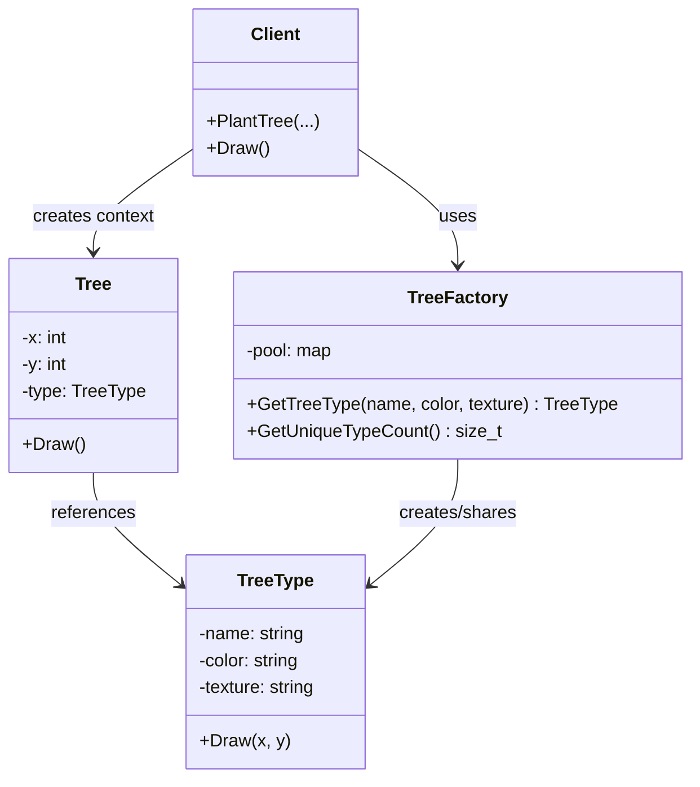

こんにちは！パン君です。  

今回は GoF（Gang of Four）のデザインパターンのフライウェイト編になります。  
サンプルコード（C++）、作り方、使うタイミング、注意点などを含めて実用的に解説します。  

## はじめに

フライウェイト（Flyweight）パターンとは、**大量の類似オブジェクト間で共通状態を共有し、メモリ使用量を削減する**ための構造パターンです。  
ポイントは、状態を「共有できる部分（Intrinsic）」と「文脈ごとに異なる部分（Extrinsic）」へ分離することです。  

一次情報として、Wikipedia には次のように記載されています。  

> "In computer programming, the flyweight software design pattern refers to an object that minimizes memory usage by sharing some of its data with other similar objects."  
> （出典: [https://en.wikipedia.org/wiki/Flyweight_pattern](https://en.wikipedia.org/wiki/Flyweight_pattern)）

また Refactoring.Guru では意図が次のように明示されています。  

> "Flyweight is a structural design pattern that lets you fit more objects into the available amount of RAM by sharing common parts of state between multiple objects instead of keeping all of the data in each object."  
> （出典: [https://refactoring.guru/design-patterns/flyweight](https://refactoring.guru/design-patterns/flyweight)）

[!CARD](https://en.wikipedia.org/wiki/Flyweight_pattern)

[!CARD](https://refactoring.guru/design-patterns/flyweight)

## ユースケース

採用を検討する代表例です。  

- **同種オブジェクトを大量に生成する場合**  
  例：ゲームの弾丸・木・パーティクル、地図上のマーカー、テキスト描画のグリフ。  
- **重い状態が多数重複している場合**  
  例：テクスチャ、フォント情報、色設定、メタデータ。  
- **RAM制約が厳しい環境で動かす場合**  
  例：モバイル端末、組み込み環境、大規模同時描画。  

## 構造

Flyweightパターンの主要要素です。  

1. **Flyweight**  
   共有される不変の内部状態（Intrinsic state）を保持する。  
2. **Context**  
   個別の外部状態（Extrinsic state）を保持し、Flyweightと組み合わせて1つの実体として扱う。  
3. **FlyweightFactory**  
   キーに基づいてFlyweightを再利用し、未生成なら作成してキャッシュする。  
4. **Client**  
   Contextを管理し、必要時にFactory経由でFlyweightを取得する。  



## C++ 実装例

ここでは「森林描画」を例にします。  
`TreeType` が共有される Flyweight（内部状態）で、`Tree` が座標を持つ Context（外部状態）です。  

```cpp
#include <iostream>
#include <memory>
#include <string>
#include <unordered_map>
#include <vector>

// Flyweight: 共有される不変データ
class TreeType {
public:
    TreeType(std::string name, std::string color, std::string texture)
        : name_(std::move(name)), color_(std::move(color)), texture_(std::move(texture)) {}

    void Draw(int x, int y) const {
        // 実際の描画エンジン呼び出しを想定（ここでは簡略化）
        std::cout << "Draw " << name_ << " at (" << x << "," << y
                  << ") color=" << color_ << " texture=" << texture_ << "\n";
    }

private:
    std::string name_;
    std::string color_;
    std::string texture_;
};

// FlyweightFactory: 共有オブジェクトの生成・再利用
class TreeFactory {
public:
    std::shared_ptr<const TreeType> GetTreeType(const std::string& name,
                                                const std::string& color,
                                                const std::string& texture) {
        const std::string key = name + "|" + color + "|" + texture;
        auto it = pool_.find(key);
        if (it != pool_.end()) {
            return it->second;
        }

        auto type = std::make_shared<TreeType>(name, color, texture);
        pool_.emplace(key, type);
        return type;
    }

    std::size_t GetUniqueTypeCount() const {
        return pool_.size();
    }

private:
    std::unordered_map<std::string, std::shared_ptr<const TreeType>> pool_;
};

// Context: 個別状態（座標）+ Flyweight参照
class Tree {
public:
    Tree(int x, int y, std::shared_ptr<const TreeType> type)
        : x_(x), y_(y), type_(std::move(type)) {}

    void Draw() const {
        type_->Draw(x_, y_);
    }

private:
    int x_;
    int y_;
    std::shared_ptr<const TreeType> type_;
};

class Forest {
public:
    void PlantTree(int x, int y,
                   const std::string& name,
                   const std::string& color,
                   const std::string& texture) {
        auto type = factory_.GetTreeType(name, color, texture);
        trees_.emplace_back(x, y, std::move(type));
    }

    void DrawSample(std::size_t limit) const {
        for (std::size_t i = 0; i < trees_.size() && i < limit; ++i) {
            trees_[i].Draw();
        }
    }

    std::size_t TreeCount() const {
        return trees_.size();
    }

    std::size_t UniqueTypeCount() const {
        return factory_.GetUniqueTypeCount();
    }

private:
    TreeFactory factory_;
    std::vector<Tree> trees_;
};

int main() {
    Forest forest;

    // 100,000本植える（種類は3つ）
    for (int i = 0; i < 100000; ++i) {
        if (i % 3 == 0) {
            forest.PlantTree(i % 1000, i / 1000, "Oak", "Green", "oak.png");
        } else if (i % 3 == 1) {
            forest.PlantTree(i % 1000, i / 1000, "Pine", "DarkGreen", "pine.png");
        } else {
            forest.PlantTree(i % 1000, i / 1000, "Sakura", "Pink", "sakura.png");
        }
    }

    std::cout << "Total trees: " << forest.TreeCount() << "\n";
    std::cout << "Unique TreeType objects: " << forest.UniqueTypeCount() << "\n";

    // サンプル表示（先頭3件だけ）
    forest.DrawSample(3);
    return 0;
}

// 実行例
// Total trees: 100000
// Unique TreeType objects: 3
// Draw Oak at (0,0) color=Green texture=oak.png
// Draw Pine at (1,0) color=DarkGreen texture=pine.png
// Draw Sakura at (2,0) color=Pink texture=sakura.png
```

この実装では、`Tree` 側に座標（外部状態）を置き、`TreeType` 側に種類情報（内部状態）を置いています。  
結果として、10万本の木でも重い種類情報オブジェクトは3つだけです。  

## メリット / デメリット

### メリット

- **メモリ使用量を大幅に削減できる**  
  重複データを共有するため、大量オブジェクトで効果が明確に出る。  
- **生成コストを下げられる**  
  既存Flyweightの再利用により、同種データの再構築を避けられる。  
- **キャッシュ戦略を集中管理できる**  
  Factoryでライフサイクルを一元化しやすい。  

### デメリット

- **設計が複雑になる**  
  内部状態と外部状態の分離設計が必須になる。  
- **CPUコストが増える場合がある**  
  呼び出し時に外部状態を受け渡すため、実装次第で計算コストが増える。  
- **スレッドセーフ設計が必要**  
  共有プールを並行アクセスする場合、同期戦略を明確にする必要がある。  

## 実務での注意点

- `Flyweight` は**不変（immutable）**として設計する。  
  共有オブジェクトを可変にすると、他Contextへ副作用が波及する。  
- Factoryキー（例: `name|color|texture`）の定義を厳密にする。  
  キー設計が曖昧だと再利用漏れや誤共有が発生する。  
- まず計測してから導入する。  
  フライウェイトは最適化パターンなので、RAMボトルネックが実測で確認できる場面で使う。  
- 破棄戦略を決める。  
  長寿命プロセスでは、プール上限や世代管理などの運用ルールを先に決める。  

## まとめ

フライウェイトパターンは、**大量の類似オブジェクトを扱う場面でRAM使用量を削減する**ための実務的な構造パターンです。  
「共有可能な内部状態」と「文脈依存の外部状態」を正しく分離し、Factoryで再利用を徹底すると、効果を安定して得られます。  

一方で、設計複雑度と運用ルール（不変性・キー設計・同期・破棄戦略）が品質を左右します。  
導入時は、計測結果を根拠に採用判断するのが最適です。  

参考・出典を記します  

[!CARD](https://en.wikipedia.org/wiki/Flyweight_pattern)

[!CARD](https://refactoring.guru/design-patterns/flyweight)

それでは、次回は別の GoF パターンについても解説していきます。  
この記事で紹介した実装は学習目的に簡素化しています。  
実プロダクションで採用する際は要件に合わせて十分に検討してください。  

以上、パン君でした！
