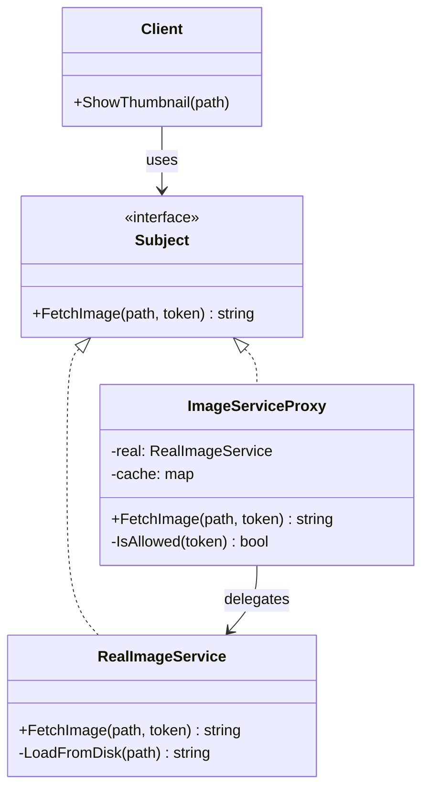

こんにちは！パン君です。  

今回は GoF（Gang of Four）のデザインパターンのプロキシ編になります。  
サンプルコード（C++）、作り方、使うタイミング、注意点などを含めて実用的に解説します。  

## はじめに

プロキシ（Proxy）パターンとは、**実体オブジェクト（RealSubject）へのアクセスを代理オブジェクト（Proxy）で制御する**ための構造パターンです。  
クライアントは実体を直接触らず、同じインターフェースを持つプロキシ越しに利用します。  

一次情報として、Wikipedia には次のように記載されています。  

> "The proxy pattern is a software design pattern ... a wrapper or agent object that is being called by the client to access the real serving object behind the scenes."  
> （出典: [https://en.wikipedia.org/wiki/Proxy_pattern](https://en.wikipedia.org/wiki/Proxy_pattern)）

また Refactoring.Guru では意図が次のように明示されています。  

> "Proxy is a structural design pattern that lets you provide a substitute or placeholder for another object. A proxy controls access to the original object..."  
> （出典: [https://refactoring.guru/design-patterns/proxy](https://refactoring.guru/design-patterns/proxy)）

[!CARD](https://en.wikipedia.org/wiki/Proxy_pattern)

[!CARD](https://refactoring.guru/design-patterns/proxy)

## ユースケース

採用を検討する代表例です。  

- **Virtual Proxy（遅延初期化）**  
  重いオブジェクトを最初から生成せず、必要になったときに初期化する。  
- **Protection Proxy（アクセス制御）**  
  認可ルールを満たすクライアントだけ実体へ通す。  
- **Remote Proxy（リモート代理）**  
  ネットワーク越しの呼び出し詳細を隠蔽する。  
- **Caching / Logging Proxy**  
  キャッシュ、ログ、メトリクスなど横断的関心事を実体の外側で扱う。  

## 構造

Proxyパターンの基本構成です。  

1. **Subject**  
   クライアントが依存する共通インターフェース。  
2. **RealSubject**  
   実際の処理を行う本体。  
3. **Proxy**  
   `Subject` を実装し、必要な前後処理（制御・監視・キャッシュ等）を追加したうえで `RealSubject` へ委譲する。  
4. **Client**  
   `Subject` のみを利用し、実体かプロキシかを意識しない。  



## C++ 実装例

ここでは「画像読み込みサービス」を例にします。  
`ImageServiceProxy` が **認可チェック** と **キャッシュ** を担当し、必要に応じて `RealImageService` へ処理を委譲します。  

```cpp
#include <iostream>
#include <memory>
#include <string>
#include <unordered_map>

// Subject
class IImageService {
public:
    virtual ~IImageService() = default;
    virtual std::string FetchImage(const std::string& path, const std::string& token) = 0;
};

// RealSubject
class RealImageService : public IImageService {
public:
    std::string FetchImage(const std::string& path, const std::string& token) override {
        (void)token; // 実運用では監査等に使う
        return LoadFromDisk(path);
    }

private:
    std::string LoadFromDisk(const std::string& path) {
        std::cout << "[Real] loading from disk: " << path << "\n";
        return "IMAGE_BYTES(" + path + ")";
    }
};

// Proxy
class ImageServiceProxy : public IImageService {
public:
    std::string FetchImage(const std::string& path, const std::string& token) override {
        if (!IsAllowed(token)) {
            std::cout << "[Proxy] access denied\n";
            return "";
        }

        auto it = cache_.find(path);
        if (it != cache_.end()) {
            std::cout << "[Proxy] cache hit: " << path << "\n";
            return it->second;
        }

        EnsureReal();
        auto bytes = real_->FetchImage(path, token);
        cache_[path] = bytes;
        std::cout << "[Proxy] cache store: " << path << "\n";
        return bytes;
    }

private:
    bool IsAllowed(const std::string& token) const {
        return token == "valid-token";
    }

    void EnsureReal() {
        if (!real_) {
            std::cout << "[Proxy] lazy initialize RealImageService\n";
            real_ = std::make_unique<RealImageService>();
        }
    }

private:
    std::unique_ptr<RealImageService> real_;
    std::unordered_map<std::string, std::string> cache_;
};

int main() {
    std::unique_ptr<IImageService> service = std::make_unique<ImageServiceProxy>();

    // 認可失敗
    auto denied = service->FetchImage("/img/banner.png", "invalid");
    std::cout << "denied size=" << denied.size() << "\n\n";

    // 初回: lazy init + 実体呼び出し + cache store
    auto first = service->FetchImage("/img/banner.png", "valid-token");
    std::cout << "first size=" << first.size() << "\n\n";

    // 2回目: cache hit（実体呼び出しなし）
    auto second = service->FetchImage("/img/banner.png", "valid-token");
    std::cout << "second size=" << second.size() << "\n";

    return 0;
}

// 実行例
// [Proxy] access denied
// denied size=0
//
// [Proxy] lazy initialize RealImageService
// [Real] loading from disk: /img/banner.png
// [Proxy] cache store: /img/banner.png
// first size=28
//
// [Proxy] cache hit: /img/banner.png
// second size=28
```

この実装では、クライアントは `IImageService` しか知らないため、実装差し替え（実体/プロキシ）を透過的に行えます。  

## メリット / デメリット

### メリット

- **アクセス制御を透過的に追加できる**  
  認可や監査をクライアント改修なしで導入しやすい。  
- **ライフサイクル管理ができる**  
  遅延初期化や接続管理をプロキシ側へ集約できる。  
- **横断処理の分離**  
  キャッシュ・ログ・メトリクスを実体ロジックから分離しやすい。  

### デメリット

- **クラス数が増える**  
  小規模用途では過剰設計になりやすい。  
- **レイテンシ増加の可能性**  
  代理処理分のオーバーヘッドが追加される。  
- **責務肥大化のリスク**  
  1つのプロキシに機能を詰め込み過ぎると保守性が落ちる。  

## 似たパターンとの違い

- **Adapter**: インターフェースを変換する（目的は互換化）。  
- **Decorator**: 同じインターフェースで機能を動的追加する（目的は拡張）。  
- **Facade**: サブシステムへの入口を単純化する（目的は簡素化）。  
- **Proxy**: 同じインターフェースでアクセスを代理・制御する（目的は制御）。  

## 実務での注意点

- 実体とプロキシは **同一インターフェース** を厳守する。  
  ここが崩れると置換可能性が失われる。  
- キャッシュの **有効期限・無効化戦略** を先に設計する。  
  誤ったキャッシュは正しさを壊す。  
- リモートプロキシでは **タイムアウト・再試行・サーキットブレーカ** を明示的に扱う。  
- セキュリティ用途の保護プロキシでは、失敗時ログと監査証跡を必ず残す。  

## まとめ

プロキシパターンは、**実体オブジェクトへのアクセスを同一インターフェースの代理で制御する**実務的な構造パターンです。  
遅延初期化、アクセス制御、キャッシュ、監視などをクライアント非依存で導入できる点が大きな強みです。  

一方で、責務を詰め込み過ぎるとプロキシが肥大化しやすいため、用途別に分割して運用するのが安全です。  
設計時は「何を制御し、どこまで責務を持つか」を先に固定すると品質が安定します。  

参考・出典を記します  

[!CARD](https://en.wikipedia.org/wiki/Proxy_pattern)

[!CARD](https://refactoring.guru/design-patterns/proxy)

それでは、次回は別の GoF パターンについても解説していきます。  
この記事で紹介した実装は学習目的に簡素化しています。  
実プロダクションで採用する際は要件に合わせて十分に検討してください。  

以上、パン君でした！
